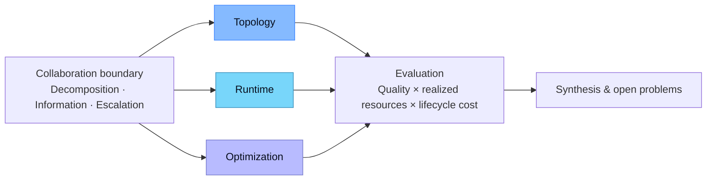

<div align="center">

# Efficiency in LLM Multi-Agent Systems

### A Survey · More intelligence. Less overhead.

**Qi Li*** · **Lexiang Xiong*** · **Haiquan Lu*** · Wenjie Qu · Xingyi Yang · Jiaheng Zhang · Xinchao Wang

National University of Singapore · University of California, Berkeley · The Hong Kong Polytechnic University

<sub>* Equal contribution</sub>

**256 cited works** &nbsp; / &nbsp; **3 control points** &nbsp; / &nbsp; **11 method families**

[🌐 Interactive page](https://lexiang-xiong.github.io/Awesome-Efficient-MAS/) · [📄 Survey PDF](docs/assets/Efficiency_LLM_MAS_Survey.pdf) · [📚 Bibliography](docs/data/references.bib) · [📝 Citation](#citation)

</div>

> When does the benefit of collaboration justify its end-to-end resource cost?

LLM multi-agent systems broaden search and combine evidence, but introduce repeated inference, growing message histories, and coordination overhead. This survey connects quality gains to their complete resource cost: first identifying the **collaboration boundary**, then organizing methods by **Topology**, **Runtime**, and **Optimization**.

## At a glance

| Control point | What changes | Method families |
| --- | --- | --- |
| **Topology** | Participating agents and communication structure | Pruning · Construction · Adaptation |
| **Runtime** | Information, models, state, and work activated per request | Communication · Routing · State · Scheduling |
| **Optimization** | Reusable configurations learned through search or training | Prompt optimization · Workflow search · Policy learning · Continual learning |



## Reading guide

- [Representative methods](#representative-methods)
- [Paper collection](#paper-collection)
- [Evaluation perspective](#evaluation-perspective)
- [Open problems](#open-problems)
- [Citation](#citation)

## Representative methods

The survey compares **29 methods** across the three control points. The table summarizes their reported effects and the conditions that matter when interpreting those results.

| Family | Method | Reported effect | Main boundary |
| --- | --- | --- | --- |
| Topology / Adaptation | [MasFACT](https://arxiv.org/abs/2605.17361) | topology transfer | drift across task streams |
| Topology / Adaptation | [MetaGen](https://arxiv.org/abs/2601.19290) | roles and topology | roles and topology co-adapt |
| Topology / Adaptation | [TacoMAS](https://arxiv.org/abs/2605.09539) | quality and calls | additional test-time calls |
| Topology / Adaptation | [TopoPrior](https://arxiv.org/abs/2605.17359) | online tokens | reported break-even |
| Topology / Construction | [G-Designer](https://arxiv.org/abs/2410.11782) | prompt tokens | fixed team and anchor |
| Topology / Construction | [GTD](https://arxiv.org/abs/2510.07799) | communication | diffusion and proxy cost |
| Topology / Construction | [HiVA](https://ojs.aaai.org/index.php/AAAI/article/view/37190) | accuracy and dollar efficiency | semantics and topology co-evolve |
| Topology / Construction | [MACNET](https://arxiv.org/abs/2406.07155) | quality across agent scale | scale and topology co-vary |
| Topology / Pruning | [AgentDropout](https://arxiv.org/abs/2503.18891) | prompt and output tokens | not query-conditioned |
| Topology / Pruning | [AgentPrune](https://arxiv.org/abs/2410.02506) | prompt tokens, dollars | offline graph search |
| Runtime / Communication | [DebateOCR](https://arxiv.org/abs/2602.00454) | input tokens, latency | multimodal channel |
| Runtime / Communication | [EcoLANG](https://aclanthology.org/2025.findings-emnlp.284/) | response and total tokens | induction cost excluded |
| Runtime / Communication | [S2-MAD](https://arxiv.org/abs/2502.04790) | message tokens | evidence retention |
| Runtime / Routing | [CASTER](https://arxiv.org/abs/2601.19793) | dollars | quality tolerance varies |
| Runtime / Routing | [RCR-Router](https://arxiv.org/abs/2508.04903) | exposed context | memory construction cost |
| Runtime / Routing | [Smurfs](https://arxiv.org/abs/2405.05955) | tokens and pass rate | tool retries remain |
| Runtime / Scheduling | [Act-or-Defer](https://arxiv.org/abs/2606.29654) | calls and risk | calibration required |
| Runtime / Scheduling | [AgentRadio](https://arxiv.org/abs/2607.28430) | task quality and API cost | wall time not reported |
| Runtime / State | [KVCOMM](https://arxiv.org/abs/2510.12872) | KV traffic, prefill | compatibility assumptions |
| Runtime / State | [TokenDance](https://arxiv.org/abs/2604.03143) | KV memory, concurrency | workload and hardware specific |
| Optimization / Continual | [MetaTeam](https://arxiv.org/abs/2605.29790) | reusable team updates | evolution cost not isolated |
| Optimization / Policy | [CORL](https://arxiv.org/abs/2511.02755) | calls and dollars | rollout cost |
| Optimization / Policy | [LEMON](https://arxiv.org/abs/2605.14483) | orchestration | counterfactual cost |
| Optimization / Policy | [OPTIMA](https://arxiv.org/abs/2410.08115) | message tokens | quality–length trade-off |
| Optimization / Prompt | [MAPGD](https://arxiv.org/abs/2509.11361) | search tokens, calls, and F1 | wall time increases |
| Optimization / Prompt | [MAPRO](https://arxiv.org/abs/2510.07475) | task quality | search cost excluded |
| Optimization / Workflow | [AFlow](https://arxiv.org/abs/2410.10762) | executable workflow | search amortization |
| Optimization / Workflow | [MASS](https://arxiv.org/abs/2502.02533) | reusable workflow | coupled search stages |
| Optimization / Workflow | [MetaAgent](https://arxiv.org/abs/2507.22606) | design and deployment tokens | human-design cost unmeasured |

## Paper collection

Explore the works discussed in the survey, grouped by section. A paper may appear in multiple sections when it addresses several aspects of efficiency.

<details>
<summary><b>Topology</b> · 27 papers</summary>

| Year | Paper & authors |
| --- | --- |
| 2026 | [GoAgent: Group-of-Agents Communication Topology Generation for LLM-based Multi-Agent Systems](https://arxiv.org/abs/2603.19677)<br><sub>Hongjiang Chen, Xin Zheng, Yixin Liu, Pengfei Jiao, Shiyuan Li, et al.</sub> |
| 2026 | [HiVA: Self-Organized Hierarchical Variable Agent via Goal-Driven Semantic-Topological Evolution](https://ojs.aaai.org/index.php/AAAI/article/view/37190)<br><sub>Jinzhou Tang, Jusheng Zhang, Qinhan Lv, Sidi Liu, Jing Yang, et al.</sub> |
| 2026 | [HieraMAS: Optimizing Intra-Node LLM Mixtures and Inter-Node Topology for Multi-Agent Systems](https://arxiv.org/abs/2602.20229)<br><sub>Tianjun Yao, Zhaoyi Li, Zhiqiang Shen</sub> |
| 2026 | [Learning Transferable Topology Priors for Multi-Agent LLM Collaboration Across Domains](https://arxiv.org/abs/2605.17359)<br><sub>Taolin Zhang, Zijie Zhou, Jiuheng Wan, Tingyuan Hu, Chengyu Wang, et al.</sub> |
| 2026 | [MasFACT: Continual Multi-Agent Topology Learning via Geometry-Aware Posterior Transfer](https://arxiv.org/abs/2605.17361)<br><sub>Xuefei Wang, Jialu Wang, Fengbo Zhang, Yihan Hu, Di Zhang, et al.</sub> |
| 2026 | [MetaGen: Self-Evolving Roles and Topologies for Multi-Agent LLM Reasoning](https://arxiv.org/abs/2601.19290)<br><sub>Yimeng Wang, Jiaxing Zhao, Hongbin Xie, Hexing Ma, Yuzhen Lei, et al.</sub> |
| 2026 | [OFA-MAS: One-for-All Multi-Agent System Topology Design based on Mixture-of-Experts Graph Generative Models](https://arxiv.org/abs/2601.12996)<br><sub>Shiyuan Li, Yixin Liu, Yu Zheng, Mei Li, Quoc Viet Hung Nguyen, et al.</sub> |
| 2026 | [RADAR: Redundancy-Aware Diffusion for Multi-Agent Communication Structure Generation](https://arxiv.org/abs/2605.09907)<br><sub>Zhen Zhang, Wanjing Zhou, Juncheng Li, Hao Fei, Jun Wen, et al.</sub> |
| 2026 | [Relational Priors as Convergence Pressure in LLM-Based Multi-Agent Systems](https://arxiv.org/abs/2608.03239)<br><sub>Ming Shen, Chao Shang, Sadat Shahriar, Devang Kulshreshtha, Yi Zhang, et al.</sub> |
| 2026 | [TacoMAS: Test-Time Co-Evolution of Topology and Capability in LLM-based Multi-Agent Systems](https://arxiv.org/abs/2605.09539)<br><sub>Chen Xu, Yicheng Hu, Ruizi Wang, Xinyu Lin, Wenjie Wang, et al.</sub> |
| 2025 | [A survey of agent interoperability protocols: Model Context Protocol (MCP), Agent Communication Protocol (ACP), Agent-to-Agent Protocol (A2A), and Agent Network Protocol (ANP)](https://arxiv.org/abs/2505.02279)<br><sub>Abul Ehtesham, Aditi Singh, Gaurav Kumar Gupta, Saket Kumar</sub> |
| 2025 | [AMAS: Adaptively Determining Communication Topology for LLM-based Multi-Agent System](https://arxiv.org/abs/2510.01617)<br><sub>Hui Yi Leong, Yuheng Li, Yuqing Wu, Wenwen Ouyang, Wei Zhu, et al.</sub> |
| 2025 | [Adaptive Graph Pruning for Multi-Agent Communication](https://arxiv.org/abs/2506.02951)<br><sub>Boyi Li, Zhonghan Zhao, Der-Horng Lee, Gaoang Wang</sub> |
| 2025 | [Agent Network Protocol Technical White Paper](https://arxiv.org/abs/2508.00007)<br><sub>Gaowei Chang, Eidan Lin, Chengxuan Yuan, Rizhao Cai, Binbin Chen, et al.</sub> |
| 2025 | [AgentDropout: Dynamic Agent Elimination for Token-Efficient and High-Performance LLM-Based Multi-Agent Collaboration](https://arxiv.org/abs/2503.18891)<br><sub>Zhexuan Wang, Yutong Wang, Xuebo Liu, Liang Ding, Miao Zhang, et al.</sub> |
| 2025 | [Assemble Your Crew: Automatic Multi-agent Communication Topology Design via Autoregressive Graph Generation](https://arxiv.org/abs/2507.18224)<br><sub>Shiyuan Li, Yixin Liu, Qingsong Wen, Chengqi Zhang, Shirui Pan</sub> |
| 2025 | [Dynamic Generation of Multi-LLM Agents Communication Topologies with Graph Diffusion Models](https://arxiv.org/abs/2510.07799)<br><sub>Eric Hanchen Jiang, Mengting Li, Guancheng Wan, Sophia Yin, Yuchen Wu, et al.</sub> |
| 2025 | [GEMMAS: Graph-based Evaluation Metrics for Multi Agent Systems](https://arxiv.org/abs/2507.13190)<br><sub>Jisoo Lee, Raeyoung Chang, Dongwook Kwon, Harmanpreet Singh, Nikhil Verma</sub> |
| 2025 | [SafeSieve: From Heuristics to Experience in Progressive Pruning for LLM-based Multi-Agent Communication](https://arxiv.org/abs/2508.11733)<br><sub>Ruijia Zhang, Xinyan Zhao, Ruixiang Wang, Sigen Chen, Guibin Zhang, et al.</sub> |
| 2025 | [Understanding the Information Propagation Effects of Communication Topologies in LLM-based Multi-Agent Systems](https://arxiv.org/abs/2505.23352)<br><sub>Xu Shen, Yixin Liu, Yiwei Dai, Yili Wang, Rui Miao, et al.</sub> |
| 2024 | [Cut the Crap: An Economical Communication Pipeline for LLM-based Multi-Agent Systems](https://arxiv.org/abs/2410.02506)<br><sub>Guibin Zhang, Yanwei Yue, Zhixun Li, Sukwon Yun, Guancheng Wan, et al.</sub> |
| 2024 | [G-Designer: Architecting Multi-agent Communication Topologies via Graph Neural Networks](https://arxiv.org/abs/2410.11782)<br><sub>Guibin Zhang, Yanwei Yue, Xiangguo Sun, Guancheng Wan, Miao Yu, et al.</sub> |
| 2024 | [Improving Multi-Agent Debate with Sparse Communication Topology](https://arxiv.org/abs/2406.11776)<br><sub>Yunxuan Li, Yibing Du, Jiageng Zhang, Le Hou, Peter Grabowski, et al.</sub> |
| 2024 | [Learning Multi-Agent Communication from Graph Modeling Perspective](https://arxiv.org/abs/2405.08550)<br><sub>Shengchao Hu, Li Shen, Ya Zhang, Dacheng Tao</sub> |
| 2024 | [Scaling Large Language Model-based Multi-Agent Collaboration](https://arxiv.org/abs/2406.07155)<br><sub>Chen Qian, Zihao Xie, YiFei Wang, Wei Liu, Kunlun Zhu, et al.</sub> |
| 2023 | [A Dynamic LLM-Powered Agent Network for Task-Oriented Agent Collaboration](https://arxiv.org/abs/2310.02170)<br><sub>Zijun Liu, Yanzhe Zhang, Peng Li, Yang Liu, Diyi Yang</sub> |
| 2023 | [Improving Factuality and Reasoning in Language Models through Multiagent Debate](https://arxiv.org/abs/2305.14325)<br><sub>Yilun Du, Shuang Li, Antonio Torralba, Joshua B. Tenenbaum, Igor Mordatch</sub> |

</details>

<details>
<summary><b>Runtime</b> · 116 papers</summary>

| Year | Paper & authors |
| --- | --- |
| 2026 | [Agent Harness Engineering: A Survey](https://openreview.net/forum?id=eONq7FdiHa)<br><sub>Junjie Li, Xi Xiao, Yunbei Zhang, Chen Liu, Lin Zhao, et al.</sub> |
| 2026 | [Agent Q-Mix: Selecting the Right Action for LLM Multi-Agent Systems through Reinforcement Learning](https://arxiv.org/abs/2604.00344)<br><sub>Eric Hanchen Jiang, Levina Li, Rui Sun, Xiao Liang, Yubei Li, et al.</sub> |
| 2026 | [Agent System Operations: Categorization, Challenges, and Future Directions](https://arxiv.org/abs/2606.01581)<br><sub>Zexin Wang, Changhua Pei, Yuanhao Liu, Jingjing Li, Yintong Huo, et al.</sub> |
| 2026 | [AgentRadio: Passive Awareness for Long-Horizon Multi-Agent Collaboration](https://arxiv.org/abs/2607.28430)<br><sub>Xinxing Ren, Qianbo Zang, Ziyan Wang, Caelum Forder, Suman Deb, et al.</sub> |
| 2026 | [BANDMAS: Causality-Inspired Semantic Packet Scheduling for Bandwidth-Efficient Multi-Agent Collaboration](https://arxiv.org/abs/2608.00458)<br><sub>Jiangwen Dong, Wanyu Lin</sub> |
| 2026 | [Breaking the Martingale Curse: Multi-Agent Debate via Asymmetric Cognitive Potential Energy](https://arxiv.org/abs/2603.06801)<br><sub>Yuhan Liu, Juntian Zhang, Yichen Wu, Martin Takac, Salem Lahlou, et al.</sub> |
| 2026 | [Budgeted Act-or-Defer Multi-Agent LLM Deliberation with Local Reliability Bounds](https://arxiv.org/abs/2606.29654)<br><sub>Mengdie Flora Wang, Haochen Xie, Guanghui Wang, Devin Zhang, Jae Oh Woo</sub> |
| 2026 | [CASTER: Breaking the Cost-Performance Barrier in Multi-Agent Orchestration via Context-Aware Strategy for Task Efficient Routing](https://arxiv.org/abs/2601.19793)<br><sub>Shanyv Liu, Xuyang Yuan, Tao Chen, Zijun Zhan, Zhu Han, et al.</sub> |
| 2026 | [Conflict-Resilient Multi-Agent Reasoning via Signed Graph Modeling](https://arxiv.org/abs/2605.19418)<br><sub>Longgang He, Longzhu He, Daojing He, Chaozhuo Li</sub> |
| 2026 | [Cross-Modal Memory Compression for Efficient Multi-Agent Debate](https://arxiv.org/abs/2602.00454)<br><sub>Jing Wu, Yue Sun, Tianpei Xie, Suiyao Chen, Jingyuan Bao, et al.</sub> |
| 2026 | [Digital Pantheon: Simulating and Auditing Coalition Formation with LLM Agents](https://arxiv.org/abs/2607.15095)<br><sub>Dylan Van Mulders, Matthias Bogaert, Dirk Van den Poel</sub> |
| 2026 | [Emergence of Biased Consensus in Multi-Agent LLM Debates](https://arxiv.org/abs/2608.02827)<br><sub>Maya Okawa</sub> |
| 2026 | [Enhancing Multi-Agent Communication through Attention Steering with Context Relevance](https://arxiv.org/abs/2605.30136)<br><sub>Hongxiang Zhang, Yuan Tian, Tianyi Zhang</sub> |
| 2026 | [EquiMem: Calibrating Shared Memory in Multi-Agent Debate via Game-Theoretic Equilibrium](https://arxiv.org/abs/2605.09278)<br><sub>Yuqiao Meng, Sakshi Sunil Narvekar, Luoxi Tang, Rupali Rajendra Vaje, Yingxue Zhang, et al.</sub> |
| 2026 | [How Do AI Agents Spend Your Money? Analyzing and Predicting Token Consumption in Agentic Coding Tasks](https://arxiv.org/abs/2604.22750)<br><sub>Longju Bai, Zhemin Huang, Xingyao Wang, Jiao Sun, Rada Mihalcea, et al.</sub> |
| 2026 | [How Task Structure Limits Multi-Agent Success: An Information-Theoretic Analysis](https://arxiv.org/abs/2606.13733)<br><sub>Shi Pan, Ming Luo</sub> |
| 2026 | [LEMON: Learning Executable Multi-Agent Orchestration via Counterfactual Reinforcement Learning](https://arxiv.org/abs/2605.14483)<br><sub>Xudong Chen, Yixin Liu, Hua Wei, Kaize Ding</sub> |
| 2026 | [LRAgent: Efficient KV Cache Sharing for Multi-LoRA LLM Agents](https://arxiv.org/abs/2602.01053)<br><sub>Hyesung Jeon, Hyeongju Ha, Jae-Joon Kim</sub> |
| 2026 | [LSTM-MAS: A Long Short-Term Memory Inspired Multi-Agent System for Long-Context Understanding](https://arxiv.org/abs/2601.11913)<br><sub>Yichen Jiang, Jiakang Yuan, Chongjun Tu, Peng Ye, Tao Chen</sub> |
| 2026 | [LatentMem: Customizing Latent Memory for Multi-Agent Systems](https://arxiv.org/abs/2602.03036)<br><sub>Muxin Fu, Xiangyuan Xue, Yafu Li, Zefeng He, Siyuan Huang, et al.</sub> |
| 2026 | [Learning to Interrupt in Language-based Multi-agent Communication](https://arxiv.org/abs/2604.06452)<br><sub>Danqing Wang, Da Yin, Ruta Desai, Lei Li, Asli Celikyilmaz, et al.</sub> |
| 2026 | [MARCH: Multi-Agent Reinforced Self-Check for LLM Hallucination](https://arxiv.org/abs/2603.24579)<br><sub>Zhuo Li, Yupeng Zhang, Pengyu Cheng, Jiajun Song, Mengyu Zhou, et al.</sub> |
| 2026 | [Misinformation Propagation in Benign Multi-Agent Systems](https://arxiv.org/abs/2606.16710)<br><sub>Jonas Becker, Jan Philip Wahle, Terry Ruas, Bela Gipp</sub> |
| 2026 | [Multi-Agent Memory from a Computer Architecture Perspective: Visions and Challenges Ahead](https://arxiv.org/abs/2603.10062)<br><sub>Zhongming Yu, Naicheng Yu, Hejia Zhang, Wentao Ni, Mingrui Yin, et al.</sub> |
| 2026 | [Not All Flips Are Conformity: Decomposing Stance Convergence in Multi-Agent LLM Debate](https://arxiv.org/abs/2606.00820)<br><sub>Xiqi Hao, Zengqing Wu, Yu-Xuan Qiu, Chuan Xiao, Ruiqi Xu, et al.</sub> |
| 2026 | [Reliability-Contagion Feasibility in LLM Multi-Agent Networks](https://arxiv.org/abs/2607.21912)<br><sub>Ruiwu Niu, Xincheng Shu, Ying Zhao</sub> |
| 2026 | [Rethinking the Value of Multi-Agent Workflow: A Strong Single Agent Baseline](https://arxiv.org/abs/2601.12307)<br><sub>Jiawei Xu, Arief Koesdwiady, Sisong Bei, Yan Han, Baixiang Huang, et al.</sub> |
| 2026 | [Scaling LLM-Driven Multi-Agent Systems: Design Principles and Architectural Scalability Analysis](https://arxiv.org/abs/2607.27942)<br><sub>Linus Sander, Fengjunjie Pan, Vahid Zolfaghari, Andre Schamschurko, Nenad Petrovic, et al.</sub> |
| 2026 | [Taming ``Zombie'' Agents: A Markov State-Aware Framework for Resilient Multi-Agent Evolution](https://arxiv.org/abs/2605.17348)<br><sub>Taolin Zhang, Pukun Zhao, Qizhou Chen, Jiuheng Wan, Chen Chen, et al.</sub> |
| 2026 | [The Deliberative Illusion: Diagnosing Factual Attrition and Stance Homogenization in Multi-Agent LLM Deliberation](https://arxiv.org/abs/2606.03032)<br><sub>Herun Wan, Jiaying Wu, Minnan Luo, Fanxiao Li, Ningnan Wang, et al.</sub> |
| 2026 | [The Ringelmann Effect in Multi-Agent LLM Systems: A Scaling Law for Effective Team Size](https://arxiv.org/abs/2606.02646)<br><sub>Blaž Bertalanič, Carolina Fortuna</sub> |
| 2026 | [TodyComm: Task-Oriented Dynamic Communication for Multi-Round LLM-based Multi-Agent System](https://arxiv.org/abs/2602.03688)<br><sub>Wenzhe Fan, Tommaso Tognoli, Henry Peng Zou, Chunyu Miao, Yibo Wang, et al.</sub> |
| 2026 | [Token Coherence: Adapting MESI Cache Protocols to Minimize Synchronization Overhead in Multi-Agent LLM Systems](https://arxiv.org/abs/2603.15183)<br><sub>Vladyslav Parakhin</sub> |
| 2026 | [TokenDance: Scaling Multi-Agent LLM Serving via Collective KV Cache Sharing](https://arxiv.org/abs/2604.03143)<br><sub>Zhuohang Bian, Feiyang Wu, Chengrui Zhang, Hangcheng Dong, Yun Liang, et al.</sub> |
| 2026 | [Tokenomics: Quantifying Where Tokens Are Used in Agentic Software Engineering](https://arxiv.org/abs/2601.14470)<br><sub>Mohamad Salim, Jasmine Latendresse, SayedHassan Khatoonabadi, Emad Shihab</sub> |
| 2026 | [What Do Agents Communicate? Characterizing Information Exchange in Multi-Agent Systems](https://arxiv.org/abs/2605.20548)<br><sub>Yong Jin Chun, Iftekhar Ahmed</sub> |
| 2026 | [When Do Multi-Agent Systems Help? An Information Bottleneck Perspective](https://arxiv.org/abs/2607.16133)<br><sub>Wendi Yu, Lianhao Zhou, Xiangjue Dong, Sai Sudarshan Barath, Declan Staunton, et al.</sub> |
| 2026 | [When Helping Hurts and How to Fix It: Multi-Agent Debate for Data Cleaning](https://arxiv.org/abs/2606.02866)<br><sub>Chirag Parmar, Akshat Mehta, Henglin Wu, Jagadish Ramamurthy, Shweta Medhekar</sub> |
| 2026 | [When Truth Is Distributed: Misinformation Derails Collective Fact Recovery in LLM-Based Multi-Agent Systems](https://arxiv.org/abs/2608.03421)<br><sub>Chenfei Yan, Zeyang Yue, Feifei Zhao, Erliang Lin, Lu Jia, et al.</sub> |
| 2026 | [Where Reasoning Diverges: Localized Multi-Agent Debate for Multi-Hop Question Answering](https://arxiv.org/abs/2608.01463)<br><sub>Weijun Gao, Xiang Ding, Haoyang Liu, Tiancheng Xing</sub> |
| 2025 | [A Comprehensive Empirical Evaluation of Agent Frameworks on Code-centric Software Engineering Tasks](https://arxiv.org/abs/2511.00872)<br><sub>Zhuowen Yin, Cuifeng Gao, Chunsong Fan, Wenzhang Yang, Yinxing Xue, et al.</sub> |
| 2025 | [A-MEM: Agentic Memory for LLM Agents](https://arxiv.org/abs/2502.12110)<br><sub>Wujiang Xu, Zujie Liang, Kai Mei, Hang Gao, Juntao Tan, et al.</sub> |
| 2025 | [Agent KB: Leveraging Cross-Domain Experience for Agentic Problem Solving](https://arxiv.org/abs/2507.06229)<br><sub>Xiangru Tang, Tianrui Qin, Tianhao Peng, Ziyang Zhou, Daniel Shao, et al.</sub> |
| 2025 | [AgentNet: Decentralized Evolutionary Coordination for LLM-based Multi-Agent Systems](https://arxiv.org/abs/2504.00587)<br><sub>Yingxuan Yang, Huacan Chai, Shuai Shao, Yuanyi Song, Siyuan Qi, et al.</sub> |
| 2025 | [Agentic Retrieval-Augmented Generation: A Survey on Agentic RAG](https://arxiv.org/abs/2501.09136)<br><sub>Aditi Singh, Abul Ehtesham, Saket Kumar, Tala Talaei Khoei, Athanasios V. Vasilakos</sub> |
| 2025 | [Agentic Services Computing](https://arxiv.org/abs/2509.24380)<br><sub>Shuiguang Deng, Hailiang Zhao, Ziqi Wang, Wenzhuo Qian, Xiang Ao, et al.</sub> |
| 2025 | [AnyMAC: Cascading Flexible Multi-Agent Collaboration via Next-Agent Prediction](https://arxiv.org/abs/2506.17784)<br><sub>Song Wang, Zhen Tan, Zihan Chen, Shuang Zhou, Tianlong Chen, et al.</sub> |
| 2025 | [Cache-to-Cache: Direct Semantic Communication Between Large Language Models](https://arxiv.org/abs/2510.03215)<br><sub>Tianyu Fu, Zihan Min, Hanling Zhang, Jichao Yan, Guohao Dai, et al.</sub> |
| 2025 | [CodeAgents: A Token-Efficient Framework for Codified Multi-Agent Reasoning in LLMs](https://arxiv.org/abs/2507.03254)<br><sub>Bruce Yang, Xinfeng He, Huan Gao, Yifan Cao, Xiaofan Li, et al.</sub> |
| 2025 | [Collaborative Memory: Multi-User Memory Sharing in LLM Agents with Dynamic Access Control](https://arxiv.org/abs/2505.18279)<br><sub>Alireza Rezazadeh, Zichao Li, Ange Lou, Yuying Zhao, Wei Wei, et al.</sub> |
| 2025 | [Controlling Performance and Budget of a Centralized Multi-agent LLM System with Reinforcement Learning](https://arxiv.org/abs/2511.02755)<br><sub>Bowen Jin, TJ Collins, Donghan Yu, Mert Cemri, Shenao Zhang, et al.</sub> |
| 2025 | [EcoLANG: Efficient and Effective Agent Communication Language Induction for Social Simulation](https://aclanthology.org/2025.findings-emnlp.284/)<br><sub>Xinyi Mou, Chen Qian, Wei Liu, Ling Yan, Yao Hu, et al.</sub> |
| 2025 | [Flow: Modularized Agentic Workflow Automation](https://arxiv.org/abs/2501.07834)<br><sub>Boye Niu, Yiliao Song, Kai Lian, Yifan Shen, Yu Yao, et al.</sub> |
| 2025 | [G-Memory: Tracing Hierarchical Memory for Multi-Agent Systems](https://arxiv.org/abs/2506.07398)<br><sub>Guibin Zhang, Muxin Fu, Guancheng Wan, Miao Yu, Kun Wang, et al.</sub> |
| 2025 | [Graph of Agents: Principled Long Context Modeling by Emergent Multi-Agent Collaboration](https://arxiv.org/abs/2509.21848)<br><sub>Taejong Joo, Shu Ishida, Ivan Sosnovik, Bryan Lim, Sahand Rezaei-Shoshtari, et al.</sub> |
| 2025 | [Intrinsic Memory Agents: Heterogeneous Multi-Agent LLM Systems through Structured Contextual Memory](https://arxiv.org/abs/2508.08997)<br><sub>Sizhe Yuen, Francisco Gomez Medina, Ting Su, Yali Du, Adam J. Sobey</sub> |
| 2025 | [KVCOMM: Online Cross-context KV-cache Communication for Efficient LLM-based Multi-agent Systems](https://arxiv.org/abs/2510.12872)<br><sub>Hancheng Ye, Zhengqi Gao, Mingyuan Ma, Qinsi Wang, Yuzhe Fu, et al.</sub> |
| 2025 | [LEGOMem: Modular Procedural Memory for Multi-agent LLM Systems for Workflow Automation](https://arxiv.org/abs/2510.04851)<br><sub>Dongge Han, Camille Couturier, Daniel Madrigal Diaz, Xuchao Zhang, Victor Rühle, et al.</sub> |
| 2025 | [Latent Collaboration in Multi-Agent Systems](https://arxiv.org/abs/2511.20639)<br><sub>Jiaru Zou, Ruizhong Qiu, Gaotang Li, Xiyuan Yang, Katherine Tieu, et al.</sub> |
| 2025 | [MA-RAG: Multi-Agent Retrieval-Augmented Generation via Collaborative Chain-of-Thought Reasoning](https://arxiv.org/abs/2505.20096)<br><sub>Thang Nguyen, Peter Chin, Yu-Wing Tai</sub> |
| 2025 | [MALLM: Multi-Agent Large Language Models Framework](https://arxiv.org/abs/2509.11656)<br><sub>Jonas Becker, Lars Benedikt Kaesberg, Niklas Bauer, Jan Philip Wahle, Terry Ruas, et al.</sub> |
| 2025 | [MIRIX: Multi-Agent Memory System for LLM-Based Agents](https://arxiv.org/abs/2507.07957)<br><sub>Yu Wang, Xi Chen</sub> |
| 2025 | [Maestro: Learning to Collaborate via Conditional Listwise Policy Optimization for Multi-Agent LLMs](https://arxiv.org/abs/2511.06134)<br><sub>Wei Yang, Jiacheng Pang, Shixuan Li, Paul Bogdan, Stephen Tu, et al.</sub> |
| 2025 | [MasRouter: Learning to Route LLMs for Multi-Agent Systems](https://arxiv.org/abs/2502.11133)<br><sub>Yanwei Yue, Guibin Zhang, Boyang Liu, Guancheng Wan, Kun Wang, et al.</sub> |
| 2025 | [Memory in LLM-based Multi-agent Systems: Mechanisms, Challenges, and Collective Intelligence](https://doi.org/10.36227/techrxiv.176539617.79044553/v1)<br><sub>Shanglin Wu, Kai Shu</sub> |
| 2025 | [Metacognitive Self-Correction for Multi-Agent System via Prototype-Guided Next-Execution Reconstruction](https://arxiv.org/abs/2510.14319)<br><sub>Xu Shen, Qi Zhang, Song Wang, Zhen Tan, Xinyu Zhao, et al.</sub> |
| 2025 | [Optimal-Agent-Selection: State-Aware Routing Framework for Efficient Multi-Agent Collaboration](https://arxiv.org/abs/2511.02200)<br><sub>Jingbo Wang, Sendong Zhao, Haochun Wang, Yuzheng Fan, Ting Liu</sub> |
| 2025 | [Q-KVComm: Efficient Multi-Agent Communication Via Adaptive KV Cache Compression](https://arxiv.org/abs/2512.17914)<br><sub>Boris Kriuk, Logic Ng</sub> |
| 2025 | [RAGentA: Multi-Agent Retrieval-Augmented Generation for Attributed Question Answering](https://arxiv.org/abs/2506.16988)<br><sub>Ines Besrour, Jingbo He, Tobias Schreieder, Michael Färber</sub> |
| 2025 | [RCR-Router: Efficient Role-Aware Context Routing for Multi-Agent LLM Systems with Structured Memory](https://arxiv.org/abs/2508.04903)<br><sub>Jun Liu, Zhenglun Kong, Changdi Yang, Fan Yang, Tianqi Li, et al.</sub> |
| 2025 | [S^2-MAD: Breaking the Token Barrier to Enhance Multi-Agent Debate Efficiency](https://arxiv.org/abs/2502.04790)<br><sub>Yuting Zeng, Weizhe Huang, Lei Jiang, Tongxuan Liu, Xitai Jin, et al.</sub> |
| 2025 | [SafeSieve: From Heuristics to Experience in Progressive Pruning for LLM-based Multi-Agent Communication](https://arxiv.org/abs/2508.11733)<br><sub>Ruijia Zhang, Xinyan Zhao, Ruixiang Wang, Sigen Chen, Guibin Zhang, et al.</sub> |
| 2025 | [Scalable Best-of-N Selection for Large Language Models via Self-Certainty](https://arxiv.org/abs/2502.18581)<br><sub>Zhewei Kang, Xuandong Zhao, Dawn Song</sub> |
| 2025 | [Stop Wasting Your Tokens: Towards Efficient Runtime Multi-Agent Systems](https://arxiv.org/abs/2510.26585)<br><sub>Fulin Lin, Shaowen Chen, Ruishan Fang, Hongwei Wang, Tao Lin</sub> |
| 2025 | [Towards Generalized Routing: Model and Agent Orchestration for Adaptive and Efficient Inference](https://arxiv.org/abs/2509.07571)<br><sub>Xiyu Guo, Shan Wang, Chunfang Ji, Xuefeng Zhao, Wenhao Xi, et al.</sub> |
| 2025 | [Tree of Agents: Improving Long-Context Capabilities of Large Language Models through Multi-Perspective Reasoning](https://arxiv.org/abs/2509.06436)<br><sub>Song Yu, Xiaofei Xu, Ke Deng, Li Li, Lin Tian</sub> |
| 2025 | [When Does Divide and Conquer Work for Long Context LLM? A Noise Decomposition Framework](https://arxiv.org/abs/2506.16411)<br><sub>Zhen Xu, Shang Zhu, Jue Wang, Junlin Wang, Ben Athiwaratkun, et al.</sub> |
| 2025 | [Which Agent Causes Task Failures and When? On Automated Failure Attribution of LLM Multi-Agent Systems](https://arxiv.org/abs/2505.00212)<br><sub>Shaokun Zhang, Ming Yin, Jieyu Zhang, Jiale Liu, Zhiguang Han, et al.</sub> |
| 2025 | [Why Do Multi-Agent LLM Systems Fail?](https://arxiv.org/abs/2503.13657)<br><sub>Mert Cemri, Melissa Z. Pan, Shuyi Yang, Lakshya A. Agrawal, Bhavya Chopra, et al.</sub> |
| 2024 | [A Collaborative Multi-Agent Approach to Retrieval-Augmented Generation Across Diverse Data](https://arxiv.org/abs/2412.05838)<br><sub>Aniruddha Salve, Saba Attar, Mahesh Deshmukh, Sayali Shivpuje, Arnab Mitra Utsab</sub> |
| 2024 | [AgentDojo: A Dynamic Environment to Evaluate Prompt Injection Attacks and Defenses for LLM Agents](https://arxiv.org/abs/2406.13352)<br><sub>Edoardo Debenedetti, Jie Zhang, Mislav Balunović, Luca Beurer-Kellner, Marc Fischer, et al.</sub> |
| 2024 | [BudgetMLAgent: A Cost-Effective LLM Multi-Agent system for Automating Machine Learning Tasks](https://arxiv.org/abs/2411.07464)<br><sub>Shubham Gandhi, Manasi Patwardhan, Lovekesh Vig, Gautam Shroff</sub> |
| 2024 | [Chain of Agents: Large Language Models Collaborating on Long-Context Tasks](https://arxiv.org/abs/2406.02818)<br><sub>Yusen Zhang, Ruoxi Sun, Yanfei Chen, Tomas Pfister, Rui Zhang, et al.</sub> |
| 2024 | [DroidSpeak: KV Cache Sharing for Cross-LLM Communication and Multi-LLM Serving](https://arxiv.org/abs/2411.02820)<br><sub>Yuhan Liu, Yuyang Huang, Jiayi Yao, Shaoting Feng, Zhuohan Gu, et al.</sub> |
| 2024 | [GraphReader: Building Graph-based Agent to Enhance Long-Context Abilities of Large Language Models](https://arxiv.org/abs/2406.14550)<br><sub>Shilong Li, Yancheng He, Hangyu Guo, Xingyuan Bu, Ge Bai, et al.</sub> |
| 2024 | [InjecAgent: Benchmarking Indirect Prompt Injections in Tool-Integrated Large Language Model Agents](https://arxiv.org/abs/2403.02691)<br><sub>Qiusi Zhan, Zhixiang Liang, Zifan Ying, Daniel Kang</sub> |
| 2024 | [LLM Agents can Autonomously Exploit One-day Vulnerabilities](https://arxiv.org/abs/2404.08144)<br><sub>Richard Fang, Rohan Bindu, Akul Gupta, Daniel Kang</sub> |
| 2024 | [LLM Agents can Autonomously Hack Websites](https://arxiv.org/abs/2402.06664)<br><sub>Richard Fang, Rohan Bindu, Akul Gupta, Qiusi Zhan, Daniel Kang</sub> |
| 2024 | [LLM×MapReduce: Simplified Long-Sequence Processing using Large Language Models](https://arxiv.org/abs/2410.09342)<br><sub>Zihan Zhou, Chong Li, Xinyi Chen, Shuo Wang, Yu Chao, et al.</sub> |
| 2024 | [LongAgent: Scaling Language Models to 128k Context through Multi-Agent Collaboration](https://arxiv.org/abs/2402.11550)<br><sub>Jun Zhao, Can Zu, Hao Xu, Yi Lu, Wei He, et al.</sub> |
| 2024 | [MAIN-RAG: Multi-Agent Filtering Retrieval-Augmented Generation](https://arxiv.org/abs/2501.00332)<br><sub>Chia-Yuan Chang, Zhimeng Jiang, Vineeth Rakesh, Menghai Pan, Chin-Chia Michael Yeh, et al.</sub> |
| 2024 | [MapCoder: Multi-Agent Code Generation for Competitive Problem Solving](https://arxiv.org/abs/2405.11403)<br><sub>Md. Ashraful Islam, Mohammed Eunus Ali, Md Rizwan Parvez</sub> |
| 2024 | [OSWorld: Benchmarking Multimodal Agents for Open-Ended Tasks in Real Computer Environments](https://arxiv.org/abs/2404.07972)<br><sub>Tianbao Xie, Danyang Zhang, Jixuan Chen, Xiaochuan Li, Siheng Zhao, et al.</sub> |
| 2024 | [Prompt Infection: LLM-to-LLM Prompt Injection within Multi-Agent Systems](https://arxiv.org/abs/2410.07283)<br><sub>Donghyun Lee, Mo Tiwari</sub> |
| 2024 | [RouteLLM: Learning to Route LLMs with Preference Data](https://arxiv.org/abs/2406.18665)<br><sub>Isaac Ong, Amjad Almahairi, Vincent Wu, Wei-Lin Chiang, Tianhao Wu, et al.</sub> |
| 2024 | [Smurfs: Multi-Agent System using Context-Efficient DFSDT for Tool Planning](https://arxiv.org/abs/2405.05955)<br><sub>Junzhi Chen, Juhao Liang, Benyou Wang</sub> |
| 2024 | [StableToolBench: Towards Stable Large-Scale Benchmarking on Tool Learning of Large Language Models](https://aclanthology.org/2024.findings-acl.664/)<br><sub>Zhicheng Guo, Sijie Cheng, Hao Wang, Shihao Liang, Yujia Qin, et al.</sub> |
| 2024 | [Teams of LLM Agents can Exploit Zero-Day Vulnerabilities](https://arxiv.org/abs/2406.01637)<br><sub>Yuxuan Zhu, Antony Kellermann, Akul Gupta, Philip Li, Richard Fang, et al.</sub> |
| 2024 | [WorkArena: How Capable Are Web Agents at Solving Common Knowledge Work Tasks?](https://arxiv.org/abs/2403.07718)<br><sub>Alexandre Drouin, Maxime Gasse, Massimo Caccia, Issam H. Laradji, Manuel Del Verme, et al.</sub> |
| 2024 | [τ-bench: A Benchmark for Tool-Agent-User Interaction in Real-World Domains](https://arxiv.org/abs/2406.12045)<br><sub>Shunyu Yao, Noah Shinn, Pedram Razavi, Karthik Narasimhan</sub> |
| 2023 | [Agents: An Open-source Framework for Autonomous Language Agents](https://arxiv.org/abs/2309.07870)<br><sub>Wangchunshu Zhou, Yuchen Eleanor Jiang, Long Li, Jialong Wu, Tiannan Wang, et al.</sub> |
| 2023 | [Encouraging Divergent Thinking in Large Language Models through Multi-Agent Debate](https://arxiv.org/abs/2305.19118)<br><sub>Tian Liang, Zhiwei He, Wenxiang Jiao, Xing Wang, Yan Wang, et al.</sub> |
| 2023 | [Exchange-of-Thought: Enhancing Large Language Model Capabilities through Cross-Model Communication](https://arxiv.org/abs/2312.01823)<br><sub>Zhangyue Yin, Qiushi Sun, Cheng Chang, Qipeng Guo, Junqi Dai, et al.</sub> |
| 2023 | [ExpeL: LLM Agents Are Experiential Learners](https://arxiv.org/abs/2308.10144)<br><sub>Andrew Zhao, Daniel Huang, Quentin Xu, Matthieu Lin, Yong-Jin Liu, et al.</sub> |
| 2023 | [Exploring Collaboration Mechanisms for LLM Agents: A Social Psychology View](https://arxiv.org/abs/2310.02124)<br><sub>Jintian Zhang, Xin Xu, Ningyu Zhang, Ruibo Liu, Bryan Hooi, et al.</sub> |
| 2023 | [FrugalGPT: How to Use Large Language Models While Reducing Cost and Improving Performance](https://arxiv.org/abs/2305.05176)<br><sub>Lingjiao Chen, Matei Zaharia, James Zou</sub> |
| 2023 | [Improving Factuality and Reasoning in Language Models through Multiagent Debate](https://arxiv.org/abs/2305.14325)<br><sub>Yilun Du, Shuang Li, Antonio Torralba, Joshua B. Tenenbaum, Igor Mordatch</sub> |
| 2023 | [L2MAC: Large Language Model Automatic Computer for Extensive Code Generation](https://arxiv.org/abs/2310.02003)<br><sub>Samuel Holt, Max Ruiz Luyten, Mihaela van der Schaar</sub> |
| 2023 | [LLM-Blender: Ensembling Large Language Models with Pairwise Ranking and Generative Fusion](https://arxiv.org/abs/2306.02561)<br><sub>Dongfu Jiang, Xiang Ren, Bill Yuchen Lin</sub> |
| 2023 | [MemGPT: Towards LLMs as Operating Systems](https://arxiv.org/abs/2310.08560)<br><sub>Charles Packer, Sarah Wooders, Kevin Lin, Vivian Fang, Shishir G. Patil, et al.</sub> |
| 2023 | [MemoryBank: Enhancing Large Language Models with Long-Term Memory](https://arxiv.org/abs/2305.10250)<br><sub>Wanjun Zhong, Lianghong Guo, Qiqi Gao, He Ye, Yanlin Wang</sub> |
| 2023 | [Multi-Agent Collaboration: Harnessing the Power of Intelligent LLM Agents](https://arxiv.org/abs/2306.03314)<br><sub>Yashar Talebirad, Amirhossein Nadiri</sub> |
| 2023 | [ToolLLM: Facilitating Large Language Models to Master 16000+ Real-world APIs](https://arxiv.org/abs/2307.16789)<br><sub>Yujia Qin, Shihao Liang, Yining Ye, Kunlun Zhu, Lan Yan, et al.</sub> |
| 2023 | [War and Peace (WarAgent): Large Language Model-based Multi-Agent Simulation of World Wars](https://arxiv.org/abs/2311.17227)<br><sub>Wenyue Hua, Lizhou Fan, Lingyao Li, Kai Mei, Jianchao Ji, et al.</sub> |
| 2023 | [WebArena: A Realistic Web Environment for Building Autonomous Agents](https://arxiv.org/abs/2307.13854)<br><sub>Shuyan Zhou, Frank F. Xu, Hao Zhu, Xuhui Zhou, Robert Lo, et al.</sub> |
| 2022 | [Self-Consistency Improves Chain of Thought Reasoning in Language Models](https://arxiv.org/abs/2203.11171)<br><sub>Xuezhi Wang, Jason Wei, Dale Schuurmans, Quoc Le, Ed Chi, et al.</sub> |

</details>

<details>
<summary><b>Optimization</b> · 31 papers</summary>

| Year | Paper & authors |
| --- | --- |
| 2026 | [Adaptive Collaboration with Humans: Metacognitive Policy Optimization for Multi-Agent LLMs with Continual Learning](https://arxiv.org/abs/2603.07972)<br><sub>Wei Yang, Defu Cao, Jiacheng Pang, Muyan Weng, Yan Liu</sub> |
| 2026 | [Agent Q-Mix: Selecting the Right Action for LLM Multi-Agent Systems through Reinforcement Learning](https://arxiv.org/abs/2604.00344)<br><sub>Eric Hanchen Jiang, Levina Li, Rui Sun, Xiao Liang, Yubei Li, et al.</sub> |
| 2026 | [Dr. MAS: Stable Reinforcement Learning for Multi-Agent LLM Systems](https://arxiv.org/abs/2602.08847)<br><sub>Lang Feng, Longtao Zheng, Shuo He, Fuxiang Zhang, Bo An</sub> |
| 2026 | [EvoCF: Multi-Agent Collaboration via Agentic Memory-Driven Evolutionary Counterfactual Planning](https://openreview.net/forum?id=zGKkewtb2w)<br><sub>Haotian Chi, Zeyu Feng, Xingrui Yu, Linbo Luo, Yew-Soon Ong, et al.</sub> |
| 2026 | [Evolve as a Team: Collaborative Self-Evolution for LLM-based Multi-Agent Systems](https://arxiv.org/abs/2605.29790)<br><sub>Zhezheng Hao, Tianfu Wang, Huanshuo Dong, Ziyan Liu, Hong Wang, et al.</sub> |
| 2026 | [EvolveRouter: Co-Evolving Routing and Prompt for Multi-Agent Question Answering](https://arxiv.org/abs/2604.05149)<br><sub>Jiatan Huang, Zheyuan Zhang, Kaiwen Shi, Yanfang Ye, Chuxu Zhang</sub> |
| 2026 | [LEMON: Learning Executable Multi-Agent Orchestration via Counterfactual Reinforcement Learning](https://arxiv.org/abs/2605.14483)<br><sub>Xudong Chen, Yixin Liu, Hua Wei, Kaize Ding</sub> |
| 2026 | [Learning Decentralized LLM Collaboration with Multi-Agent Actor Critic](https://arxiv.org/abs/2601.21972)<br><sub>Shuo Liu, Tianle Chen, Ryan Amiri, Christopher Amato</sub> |
| 2026 | [MARCH: Multi-Agent Reinforced Self-Check for LLM Hallucination](https://arxiv.org/abs/2603.24579)<br><sub>Zhuo Li, Yupeng Zhang, Pengyu Cheng, Jiajun Song, Mengyu Zhou, et al.</sub> |
| 2026 | [MAS-PromptBench: When Does Prompt Optimization Improve Multi-Agent LLM Systems?](https://arxiv.org/abs/2606.23664)<br><sub>Juyang Bai, Laixi Shi</sub> |
| 2026 | [MASPO: Joint Prompt Optimization for LLM-based Multi-Agent Systems](https://arxiv.org/abs/2605.06623)<br><sub>Zhexuan Wang, Xuebo Liu, Li Wang, Zifei Shan, Yutong Wang, et al.</sub> |
| 2026 | [MASPOB: Bandit-Based Prompt Optimization for Multi-Agent Systems with Graph Neural Networks](https://arxiv.org/abs/2603.02630)<br><sub>Zhi Hong, Qian Zhang, Jiahang Sun, Zhiwei Shang, Mingze Kong, et al.</sub> |
| 2026 | [SkillGraph: Self-Evolving Multi-Agent Collaboration with Multimodal Graph Topology](https://arxiv.org/abs/2604.17503)<br><sub>Zheng Nie, Ruolin Shen, Xinlei Yu, Bo Yin, Jiangning Zhang, et al.</sub> |
| 2025 | [Controlling Performance and Budget of a Centralized Multi-agent LLM System with Reinforcement Learning](https://arxiv.org/abs/2511.02755)<br><sub>Bowen Jin, TJ Collins, Donghan Yu, Mert Cemri, Shenao Zhang, et al.</sub> |
| 2025 | [EvoFlow: Evolving Diverse Agentic Workflows On The Fly](https://arxiv.org/abs/2502.07373)<br><sub>Guibin Zhang, Kaijie Chen, Guancheng Wan, Heng Chang, Hong Cheng, et al.</sub> |
| 2025 | [G-Memory: Tracing Hierarchical Memory for Multi-Agent Systems](https://arxiv.org/abs/2506.07398)<br><sub>Guibin Zhang, Muxin Fu, Guancheng Wan, Miao Yu, Kun Wang, et al.</sub> |
| 2025 | [LEGOMem: Modular Procedural Memory for Multi-agent LLM Systems for Workflow Automation](https://arxiv.org/abs/2510.04851)<br><sub>Dongge Han, Camille Couturier, Daniel Madrigal Diaz, Xuchao Zhang, Victor Rühle, et al.</sub> |
| 2025 | [LLM Collaboration With Multi-Agent Reinforcement Learning](https://arxiv.org/abs/2508.04652)<br><sub>Shuo Liu, Tianle Chen, Zeyu Liang, Xueguang Lyu, Christopher Amato</sub> |
| 2025 | [MA-SAPO: Multi-Agent Reasoning for Score-Aware Prompt Optimization](https://arxiv.org/abs/2510.16635)<br><sub>Wonduk Seo, Juhyeon Lee, Junseo Koh, Wonseok Choi, Hyunjin An, et al.</sub> |
| 2025 | [MAPGD: Multi-Agent Prompt Gradient Descent for Collaborative Prompt Optimization](https://arxiv.org/abs/2509.11361)<br><sub>Yichen Han, Yuhang Han, Siteng Huang, Guanyu Liu, Zhengpeng Zhou, et al.</sub> |
| 2025 | [MAPRO: Recasting Multi-Agent Prompt Optimization as Maximum a Posteriori Inference](https://arxiv.org/abs/2510.07475)<br><sub>Zheyuan Zhang, Lin Ge, Hongjiang Li, Weicheng Zhu, Chuxu Zhang, et al.</sub> |
| 2025 | [MetaAgent: Automatically Constructing Multi-Agent Systems Based on Finite State Machines](https://arxiv.org/abs/2507.22606)<br><sub>Yaolun Zhang, Xiaogeng Liu, Chaowei Xiao</sub> |
| 2025 | [Multi-Agent Design: Optimizing Agents with Better Prompts and Topologies](https://arxiv.org/abs/2502.02533)<br><sub>Han Zhou, Xingchen Wan, Ruoxi Sun, Hamid Palangi, Shariq Iqbal, et al.</sub> |
| 2025 | [Multi-agent Architecture Search via Agentic Supernet](https://arxiv.org/abs/2502.04180)<br><sub>Guibin Zhang, Luyang Niu, Junfeng Fang, Kun Wang, Lei Bai, et al.</sub> |
| 2025 | [OMAC: A Holistic Optimization Framework for LLM-Based Multi-Agent Collaboration](https://arxiv.org/abs/2505.11765)<br><sub>Shijun Li, Hilaf Hasson, Joydeep Ghosh</sub> |
| 2024 | [AFlow: Automating Agentic Workflow Generation](https://arxiv.org/abs/2410.10762)<br><sub>Jiayi Zhang, Jinyu Xiang, Zhaoyang Yu, Fengwei Teng, Xionghui Chen, et al.</sub> |
| 2024 | [Language Agents as Optimizable Graphs](https://arxiv.org/abs/2402.16823)<br><sub>Mingchen Zhuge, Wenyi Wang, Louis Kirsch, Francesco Faccio, Dmitrii Khizbullin, et al.</sub> |
| 2024 | [Optima: Optimizing Effectiveness and Efficiency for LLM-Based Multi-Agent System](https://arxiv.org/abs/2410.08115)<br><sub>Weize Chen, Jiarui Yuan, Chen Qian, Cheng Yang, Zhiyuan Liu, et al.</sub> |
| 2024 | [Self-Evolving Multi-Agent Collaboration Networks for Software Development](https://arxiv.org/abs/2410.16946)<br><sub>Yue Hu, Yuzhu Cai, Yaxin Du, Xinyu Zhu, Xiangrui Liu, et al.</sub> |
| 2024 | [Towards Efficient LLM Grounding for Embodied Multi-Agent Collaboration](https://arxiv.org/abs/2405.14314)<br><sub>Yang Zhang, Shixin Yang, Chenjia Bai, Fei Wu, Xiu Li, et al.</sub> |
| 2023 | [Automatic prompt optimization with “gradient descent” and beam search](https://aclanthology.org/2023.emnlp-main.494/)<br><sub>Reid Pryzant, Dan Iter, Jerry Li, Yin Lee, Chenguang Zhu, et al.</sub> |

</details>

<details>
<summary><b>Collaboration Boundary</b> · 10 papers</summary>

| Year | Paper & authors |
| --- | --- |
| 2026 | [How Task Structure Limits Multi-Agent Success: An Information-Theoretic Analysis](https://arxiv.org/abs/2606.13733)<br><sub>Shi Pan, Ming Luo</sub> |
| 2026 | [Single-Agent LLMs Outperform Multi-Agent Systems on Multi-Hop Reasoning Under Equal Thinking Token Budgets](https://arxiv.org/abs/2604.02460)<br><sub>Dat Tran, Douwe Kiela</sub> |
| 2026 | [When Do Multi-Agent Systems Help? An Information Bottleneck Perspective](https://arxiv.org/abs/2607.16133)<br><sub>Wendi Yu, Lianhao Zhou, Xiangjue Dong, Sai Sudarshan Barath, Declan Staunton, et al.</sub> |
| 2025 | [AnyMAC: Cascading Flexible Multi-Agent Collaboration via Next-Agent Prediction](https://arxiv.org/abs/2506.17784)<br><sub>Song Wang, Zhen Tan, Zihan Chen, Shuang Zhou, Tianlong Chen, et al.</sub> |
| 2025 | [MasRouter: Learning to Route LLMs for Multi-Agent Systems](https://arxiv.org/abs/2502.11133)<br><sub>Yanwei Yue, Guibin Zhang, Boyang Liu, Guancheng Wan, Kun Wang, et al.</sub> |
| 2025 | [Single-agent or Multi-agent Systems? Why Not Both?](https://arxiv.org/abs/2505.18286)<br><sub>Mingyan Gao, Yanzi Li, Banruo Liu, Yifan Yu, Phillip Wang, et al.</sub> |
| 2025 | [Towards a Science of Scaling Agent Systems](https://arxiv.org/abs/2512.08296)<br><sub>Yubin Kim, Ken Gu, Chanwoo Park, Chunjong Park, Samuel Schmidgall, et al.</sub> |
| 2024 | [Chain of Agents: Large Language Models Collaborating on Long-Context Tasks](https://arxiv.org/abs/2406.02818)<br><sub>Yusen Zhang, Ruoxi Sun, Yanfei Chen, Tomas Pfister, Rui Zhang, et al.</sub> |
| 2024 | [MAIN-RAG: Multi-Agent Filtering Retrieval-Augmented Generation](https://arxiv.org/abs/2501.00332)<br><sub>Chia-Yuan Chang, Zhimeng Jiang, Vineeth Rakesh, Menghai Pan, Chin-Chia Michael Yeh, et al.</sub> |
| 2022 | [Decomposed Prompting: A Modular Approach for Solving Complex Tasks](https://arxiv.org/abs/2210.02406)<br><sub>Tushar Khot, Harsh Trivedi, Matthew Finlayson, Yao Fu, Kyle Richardson, et al.</sub> |

</details>

<details>
<summary><b>Background</b> · 16 papers</summary>

| Year | Paper & authors |
| --- | --- |
| 2023 | [AutoGen: Enabling Next-Gen LLM Applications via Multi-Agent Conversation](https://arxiv.org/abs/2308.08155)<br><sub>Qingyun Wu, Gagan Bansal, Jieyu Zhang, Yiran Wu, Beibin Li, et al.</sub> |
| 2023 | [CAMEL: Communicative Agents for "Mind" Exploration of Large Language Model Society](https://arxiv.org/abs/2303.17760)<br><sub>Guohao Li, Hasan Abed Al Kader Hammoud, Hani Itani, Dmitrii Khizbullin, Bernard Ghanem</sub> |
| 2023 | [ChatDev: Communicative Agents for Software Development](https://arxiv.org/abs/2307.07924)<br><sub>Chen Qian, Wei Liu, Hongzhang Liu, Nuo Chen, Yufan Dang, et al.</sub> |
| 2023 | [Generative Agents: Interactive Simulacra of Human Behavior](https://arxiv.org/abs/2304.03442)<br><sub>Joon Sung Park, Joseph C. O'Brien, Carrie J. Cai, Meredith Ringel Morris, Percy Liang, et al.</sub> |
| 2023 | [Improving Factuality and Reasoning in Language Models through Multiagent Debate](https://arxiv.org/abs/2305.14325)<br><sub>Yilun Du, Shuang Li, Antonio Torralba, Joshua B. Tenenbaum, Igor Mordatch</sub> |
| 2023 | [MetaGPT: Meta Programming for A Multi-Agent Collaborative Framework](https://arxiv.org/abs/2308.00352)<br><sub>Sirui Hong, Mingchen Zhuge, Jiaqi Chen, Xiawu Zheng, Yuheng Cheng, et al.</sub> |
| 2023 | [Reflexion: Language Agents with Verbal Reinforcement Learning](https://arxiv.org/abs/2303.11366)<br><sub>Noah Shinn, Federico Cassano, Edward Berman, Ashwin Gopinath, Karthik Narasimhan, et al.</sub> |
| 2023 | [ToolLLM: Facilitating Large Language Models to Master 16000+ Real-world APIs](https://arxiv.org/abs/2307.16789)<br><sub>Yujia Qin, Shihao Liang, Yining Ye, Kunlun Zhu, Lan Yan, et al.</sub> |
| 2023 | [Voyager: An Open-Ended Embodied Agent with Large Language Models](https://arxiv.org/abs/2305.16291)<br><sub>Guanzhi Wang, Yuqi Xie, Yunfan Jiang, Ajay Mandlekar, Chaowei Xiao, et al.</sub> |
| 2022 | [ReAct: Synergizing Reasoning and Acting in Language Models](https://arxiv.org/abs/2210.03629)<br><sub>Shunyu Yao, Jeffrey Zhao, Dian Yu, Nan Du, Izhak Shafran, et al.</sub> |
| 2018 | [QMIX: Monotonic Value Function Factorisation for Deep Multi-Agent Reinforcement Learning](https://proceedings.mlr.press/v80/rashid18a.html)<br><sub>Tabish Rashid, Mikayel Samvelyan, Christian Schroeder de Witt, Gregory Farquhar, Jakob Foerster, et al.</sub> |
| 2017 | [Multi-Agent Actor-Critic for Mixed Cooperative-Competitive Environments](https://proceedings.neurips.cc/paper_files/paper/2017/hash/68a9750337a418a86fe06c1991a1d64c-Abstract.html)<br><sub>Ryan Lowe, Yi Wu, Aviv Tamar, Jean Harb, Pieter Abbeel, et al.</sub> |
| 2002 | [The Complexity of Decentralized Control of Markov Decision Processes](https://doi.org/10.1287/moor.27.4.819.297)<br><sub>Daniel S. Bernstein, Robert Givan, Neil Immerman, Shlomo Zilberstein</sub> |
| 1995 | [BDI Agents: From Theory to Practice](https://cdn.aaai.org/ICMAS/1995/ICMAS95-042.pdf)<br><sub>Anand S. Rao, Michael P. Georgeff</sub> |
| 1994 | [Markov Games as a Framework for Multi-Agent Reinforcement Learning](https://doi.org/10.1016/B978-1-55860-335-6.50027-1)<br><sub>Michael L. Littman</sub> |
| 1980 | [The Contract Net Protocol: High-Level Communication and Control in a Distributed Problem Solver](https://doi.org/10.1109/TC.1980.1675516)<br><sub>Reid G. Smith</sub> |

</details>

<details>
<summary><b>Evaluation</b> · 68 papers</summary>

| Year | Paper & authors |
| --- | --- |
| 2026 | [AgentCollabBench: Diagnosing When Good Agents Make Bad Collaborators](https://arxiv.org/abs/2605.08647)<br><sub>Aritra Mazumder, Shubhashis Roy Dipta, Nusrat Jahan Lia, Tanzila Khan, Kainat Raisa Hossain, et al.</sub> |
| 2026 | [Dynamic Trust-Aware Sparse Communication Topology for LLM-Based Multi-Agent Consensus](https://arxiv.org/abs/2606.01828)<br><sub>Wanshuang Gou, Zihan Liu</sub> |
| 2026 | [Graph-of-Agents: A Graph-based Framework for Multi-Agent LLM Collaboration](https://arxiv.org/abs/2604.17148)<br><sub>Sukwon Yun, Jie Peng, Pingzhi Li, Wendong Fan, Jie Chen, et al.</sub> |
| 2026 | [How Do AI Agents Spend Your Money? Analyzing and Predicting Token Consumption in Agentic Coding Tasks](https://arxiv.org/abs/2604.22750)<br><sub>Longju Bai, Zhemin Huang, Xingyao Wang, Jiao Sun, Rada Mihalcea, et al.</sub> |
| 2026 | [Learning Transferable Topology Priors for Multi-Agent LLM Collaboration Across Domains](https://arxiv.org/abs/2605.17359)<br><sub>Taolin Zhang, Zijie Zhou, Jiuheng Wan, Tingyuan Hu, Chengyu Wang, et al.</sub> |
| 2026 | [MAS-PromptBench: When Does Prompt Optimization Improve Multi-Agent LLM Systems?](https://arxiv.org/abs/2606.23664)<br><sub>Juyang Bai, Laixi Shi</sub> |
| 2026 | [Rethinking the Value of Multi-Agent Workflow: A Strong Single Agent Baseline](https://arxiv.org/abs/2601.12307)<br><sub>Jiawei Xu, Arief Koesdwiady, Sisong Bei, Yan Han, Baixiang Huang, et al.</sub> |
| 2026 | [Single-Agent LLMs Outperform Multi-Agent Systems on Multi-Hop Reasoning Under Equal Thinking Token Budgets](https://arxiv.org/abs/2604.02460)<br><sub>Dat Tran, Douwe Kiela</sub> |
| 2026 | [The Ringelmann Effect in Multi-Agent LLM Systems: A Scaling Law for Effective Team Size](https://arxiv.org/abs/2606.02646)<br><sub>Blaž Bertalanič, Carolina Fortuna</sub> |
| 2026 | [Token Economics for LLM Agents: A Dual-View Study from Computing and Economics](https://arxiv.org/abs/2605.09104)<br><sub>Yuxi Chen, Junming Chen, Chenyu He, Yiwei Li, Yicheng Ji, et al.</sub> |
| 2026 | [Tokenomics: Quantifying Where Tokens Are Used in Agentic Software Engineering](https://arxiv.org/abs/2601.14470)<br><sub>Mohamad Salim, Jasmine Latendresse, SayedHassan Khatoonabadi, Emad Shihab</sub> |
| 2026 | [When Do Multi-Agent Systems Help? An Information Bottleneck Perspective](https://arxiv.org/abs/2607.16133)<br><sub>Wendi Yu, Lianhao Zhou, Xiangjue Dong, Sai Sudarshan Barath, Declan Staunton, et al.</sub> |
| 2025 | [AgentTaxo: Dissecting and Benchmarking Token Distribution of LLM Multi-Agent Systems](https://openreview.net/forum?id=0iLbiYYIpC)<br><sub>Qian Wang, Zhenheng Tang, Zichen Jiang, Nuo Chen, Tianyu Wang, et al.</sub> |
| 2025 | [GEMMAS: Graph-based Evaluation Metrics for Multi Agent Systems](https://arxiv.org/abs/2507.13190)<br><sub>Jisoo Lee, Raeyoung Chang, Dongwook Kwon, Harmanpreet Singh, Nikhil Verma</sub> |
| 2025 | [LiveCodeBench: Holistic and Contamination Free Evaluation of Large Language Models for Code](https://arxiv.org/abs/2403.07974)<br><sub>Naman Jain, King Han, Alex Gu, Wen-Ding Li, Fanjia Yan, et al.</sub> |
| 2025 | [MALLM: Multi-Agent Large Language Models Framework](https://arxiv.org/abs/2509.11656)<br><sub>Jonas Becker, Lars Benedikt Kaesberg, Niklas Bauer, Jan Philip Wahle, Terry Ruas, et al.</sub> |
| 2025 | [MultiAgentBench: Evaluating the Collaboration and Competition of LLM agents](https://arxiv.org/abs/2503.01935)<br><sub>Kunlun Zhu, Hongyi Du, Zhaochen Hong, Xiaocheng Yang, Shuyi Guo, et al.</sub> |
| 2025 | [Towards a Science of Scaling Agent Systems](https://arxiv.org/abs/2512.08296)<br><sub>Yubin Kim, Ken Gu, Chanwoo Park, Chunjong Park, Samuel Schmidgall, et al.</sub> |
| 2025 | [Understanding the Information Propagation Effects of Communication Topologies in LLM-based Multi-Agent Systems](https://arxiv.org/abs/2505.23352)<br><sub>Xu Shen, Yixin Liu, Yiwei Dai, Yili Wang, Rui Miao, et al.</sub> |
| 2025 | [Which Agent Causes Task Failures and When? On Automated Failure Attribution of LLM Multi-Agent Systems](https://arxiv.org/abs/2505.00212)<br><sub>Shaokun Zhang, Ming Yin, Jieyu Zhang, Jiale Liu, Zhiguang Han, et al.</sub> |
| 2025 | [Why Do Multi-Agent LLM Systems Fail?](https://arxiv.org/abs/2503.13657)<br><sub>Mert Cemri, Melissa Z. Pan, Shuyi Yang, Lakshya A. Agrawal, Bhavya Chopra, et al.</sub> |
| 2024 | [AgentBoard: An Analytical Evaluation Board of Multi-turn LLM Agents](https://arxiv.org/abs/2401.13178)<br><sub>Chang Ma, Junlei Zhang, Zhihao Zhu, Cheng Yang, Yujiu Yang, et al.</sub> |
| 2024 | [AgentGym: Evolving Large Language Model-based Agents across Diverse Environments](https://arxiv.org/abs/2406.04151)<br><sub>Zhiheng Xi, Yiwen Ding, Wenxiang Chen, Boyang Hong, Honglin Guo, et al.</sub> |
| 2024 | [AppWorld: A Controllable World of Apps and People for Benchmarking Interactive Coding Agents](https://arxiv.org/abs/2407.18901)<br><sub>Harsh Trivedi, Tushar Khot, Mareike Hartmann, Ruskin Manku, Vinty Dong, et al.</sub> |
| 2024 | [BattleAgentBench: A Benchmark for Evaluating Cooperation and Competition Capabilities of Language Models in Multi-Agent Systems](https://arxiv.org/abs/2408.15971)<br><sub>Wei Wang, Dan Zhang, Tao Feng, Boyan Wang, Jie Tang</sub> |
| 2024 | [Evaluating Very Long-Term Conversational Memory of LLM Agents](https://arxiv.org/abs/2402.17753)<br><sub>Adyasha Maharana, Dong-Ho Lee, Sergey Tulyakov, Mohit Bansal, Francesco Barbieri, et al.</sub> |
| 2024 | [GPQA: A Graduate-Level Google-Proof Q&A Benchmark](https://arxiv.org/abs/2311.12022)<br><sub>David Rein, Betty Li Hou, Asa Cooper Stickland, Jackson Petty, Richard Yuanzhe Pang, et al.</sub> |
| 2024 | [LongBench: A Bilingual, Multitask Benchmark for Long Context Understanding](https://arxiv.org/abs/2308.14508)<br><sub>Yushi Bai, Xin Lv, Jiajie Zhang, Hongchang Lyu, Jiankai Tang, et al.</sub> |
| 2024 | [MMLU-Pro: A More Robust and Challenging Multi-Task Language Understanding Benchmark](https://arxiv.org/abs/2406.01574)<br><sub>Yubo Wang, Xueguang Ma, Ge Zhang, Yuansheng Ni, Abhranil Chandra, et al.</sub> |
| 2024 | [MuSR: Testing the Limits of Chain-of-Thought with Multistep Soft Reasoning](https://arxiv.org/abs/2310.16049)<br><sub>Zayne Sprague, Xi Ye, Kaj Bostrom, Swarat Chaudhuri, Greg Durrett</sub> |
| 2024 | [OSWorld: Benchmarking Multimodal Agents for Open-Ended Tasks in Real Computer Environments](https://arxiv.org/abs/2404.07972)<br><sub>Tianbao Xie, Danyang Zhang, Jixuan Chen, Xiaochuan Li, Siheng Zhao, et al.</sub> |
| 2024 | [OlympiadBench: A Challenging Benchmark for Promoting AGI with Olympiad-Level Bilingual Multimodal Scientific Problems](https://arxiv.org/abs/2402.14008)<br><sub>Chaoqun He, Renjie Luo, Yuzhuo Bai, Shengding Hu, Zhen Leng Thai, et al.</sub> |
| 2024 | [SWE-bench: Can Language Models Resolve Real-World GitHub Issues?](https://arxiv.org/abs/2310.06770)<br><sub>Carlos E. Jimenez, John Yang, Alexander Wettig, Shunyu Yao, Kexin Pei, et al.</sub> |
| 2024 | [TravelPlanner: A Benchmark for Real-World Planning with Language Agents](https://arxiv.org/abs/2402.01622)<br><sub>Jian Xie, Kai Zhang, Jiangjie Chen, Tinghui Zhu, Renze Lou, et al.</sub> |
| 2024 | [WorkArena: How Capable Are Web Agents at Solving Common Knowledge Work Tasks?](https://arxiv.org/abs/2403.07718)<br><sub>Alexandre Drouin, Maxime Gasse, Massimo Caccia, Issam H. Laradji, Manuel Del Verme, et al.</sub> |
| 2024 | [τ-bench: A Benchmark for Tool-Agent-User Interaction in Real-World Domains](https://arxiv.org/abs/2406.12045)<br><sub>Shunyu Yao, Noah Shinn, Pedram Razavi, Karthik Narasimhan</sub> |
| 2024 | [∞Bench: Extending Long Context Evaluation Beyond 100K Tokens](https://arxiv.org/abs/2402.13718)<br><sub>Xinrong Zhang, Yingfa Chen, Shengding Hu, Zihang Xu, Junhao Chen, et al.</sub> |
| 2023 | [AgentBench: Evaluating LLMs as Agents](https://arxiv.org/abs/2308.03688)<br><sub>Xiao Liu, Hao Yu, Hanchen Zhang, Yifan Xu, Xuanyu Lei, et al.</sub> |
| 2023 | [Building Cooperative Embodied Agents Modularly with Large Language Models](https://arxiv.org/abs/2307.02485)<br><sub>Hongxin Zhang, Weihua Du, Jiaming Shan, Qinhong Zhou, Yilun Du, et al.</sub> |
| 2023 | [Challenging BIG-Bench Tasks and Whether Chain-of-Thought Can Solve Them](https://arxiv.org/abs/2210.09261)<br><sub>Mirac Suzgun, Nathan Scales, Nathanael Sch"arli, Sebastian Gehrmann, Yi Tay, et al.</sub> |
| 2023 | [GAIA: a benchmark for General AI Assistants](https://arxiv.org/abs/2311.12983)<br><sub>Grégoire Mialon, Clémentine Fourrier, Craig Swift, Thomas Wolf, Yann LeCun, et al.</sub> |
| 2023 | [SOTOPIA: Interactive Evaluation for Social Intelligence in Language Agents](https://arxiv.org/abs/2310.11667)<br><sub>Xuhui Zhou, Hao Zhu, Leena Mathur, Ruohong Zhang, Haofei Yu, et al.</sub> |
| 2023 | [Voyager: An Open-Ended Embodied Agent with Large Language Models](https://arxiv.org/abs/2305.16291)<br><sub>Guanzhi Wang, Yuqi Xie, Yunfan Jiang, Ajay Mandlekar, Chaowei Xiao, et al.</sub> |
| 2023 | [WebArena: A Realistic Web Environment for Building Autonomous Agents](https://arxiv.org/abs/2307.13854)<br><sub>Shuyan Zhou, Frank F. Xu, Hao Zhu, Xuhui Zhou, Robert Lo, et al.</sub> |
| 2022 | [Competition-Level Code Generation with AlphaCode](https://arxiv.org/abs/2203.07814)<br><sub>Yujia Li, David Choi, Junyoung Chung, Nate Kushman, Julian Schrittwieser, et al.</sub> |
| 2022 | [MuSiQue: Multihop Questions via Single-hop Question Composition](https://arxiv.org/abs/2108.00573)<br><sub>Harsh Trivedi, Niranjan Balasubramanian, Tushar Khot, Ashish Sabharwal</sub> |
| 2022 | [ScienceWorld: Is Your Agent Smarter than a 5th Grader?](https://arxiv.org/abs/2203.07540)<br><sub>Ruoyao Wang, Peter Jansen, Marc-Alexandre Côté, Prithviraj Ammanabrolu</sub> |
| 2022 | [WebShop: Towards Scalable Real-World Web Interaction with Grounded Language Agents](https://arxiv.org/abs/2207.01206)<br><sub>Shunyu Yao, Howard Chen, John Yang, Karthik Narasimhan</sub> |
| 2021 | [ALFWorld: Aligning Text and Embodied Environments for Interactive Learning](https://arxiv.org/abs/2010.03768)<br><sub>Mohit Shridhar, Xingdi Yuan, Marc-Alexandre Côté, Yonatan Bisk, Adam Trischler, et al.</sub> |
| 2021 | [Are NLP Models Really Able to Solve Simple Math Word Problems?](https://arxiv.org/abs/2103.07191)<br><sub>Arkil Patel, Satwik Bhattamishra, Navin Goyal</sub> |
| 2021 | [Did Aristotle Use a Laptop? A Question Answering Benchmark with Implicit Reasoning Strategies](https://arxiv.org/abs/2101.02235)<br><sub>Mor Geva, Daniel Khashabi, Elad Segal, Tushar Khot, Dan Roth, et al.</sub> |
| 2021 | [Evaluating Large Language Models Trained on Code](https://arxiv.org/abs/2107.03374)<br><sub>Mark Chen, Jerry Tworek, Heewoo Jun, Qiming Yuan, Henrique Ponde de Oliveira Pinto, et al.</sub> |
| 2021 | [Measuring Coding Challenge Competence With APPS](https://arxiv.org/abs/2105.09938)<br><sub>Dan Hendrycks, Steven Basart, Saurav Kadavath, Mantas Mazeika, Akul Arora, et al.</sub> |
| 2021 | [Measuring Massive Multitask Language Understanding](https://arxiv.org/abs/2009.03300)<br><sub>Dan Hendrycks, Collin Burns, Steven Basart, Andy Zou, Mantas Mazeika, et al.</sub> |
| 2021 | [Measuring Mathematical Problem Solving With the MATH Dataset](https://arxiv.org/abs/2103.03874)<br><sub>Dan Hendrycks, Collin Burns, Saurav Kadavath, Akul Arora, Steven Basart, et al.</sub> |
| 2021 | [Program Synthesis with Large Language Models](https://arxiv.org/abs/2108.07732)<br><sub>Jacob Austin, Augustus Odena, Maxwell Nye, Maarten Bosma, Henryk Michalewski, et al.</sub> |
| 2021 | [Training Verifiers to Solve Math Word Problems](https://arxiv.org/abs/2110.14168)<br><sub>Karl Cobbe, Vineet Kosaraju, Mohammad Bavarian, Mark Chen, Heewoo Jun, et al.</sub> |
| 2020 | [Constructing A Multi-hop QA Dataset for Comprehensive Evaluation of Reasoning Steps](https://arxiv.org/abs/2011.01060)<br><sub>Xanh Ho, Anh-Khoa Duong Nguyen, Saku Sugawara, Akiko Aizawa</sub> |
| 2020 | [LogiQA: A Challenge Dataset for Machine Reading Comprehension with Logical Reasoning](https://arxiv.org/abs/2007.08124)<br><sub>Jian Liu, Leyang Cui, Hanmeng Liu, Dandan Huang, Yile Wang, et al.</sub> |
| 2019 | [CommonsenseQA: A Question Answering Challenge Targeting Commonsense Knowledge](https://arxiv.org/abs/1811.00937)<br><sub>Alon Talmor, Jonathan Herzig, Nicholas Lourie, Jonathan Berant</sub> |
| 2019 | [Natural Questions: A Benchmark for Question Answering Research](https://aclanthology.org/Q19-1026/)<br><sub>Tom Kwiatkowski, Jennimaria Palomaki, Olivia Redfield, Michael Collins, Ankur Parikh, et al.</sub> |
| 2019 | [On the Utility of Learning about Humans for Human-AI Coordination](https://arxiv.org/abs/1910.05789)<br><sub>Micah Carroll, Rohin Shah, Mark K. Ho, Thomas L. Griffiths, Sanjit A. Seshia, et al.</sub> |
| 2018 | [FEVER: A Large-Scale Dataset for Fact Extraction and VERification](https://arxiv.org/abs/1803.05355)<br><sub>James Thorne, Andreas Vlachos, Christos Christodoulopoulos, Arpit Mittal</sub> |
| 2018 | [HotpotQA: A Dataset for Diverse, Explainable Multi-hop Question Answering](https://arxiv.org/abs/1809.09600)<br><sub>Zhilin Yang, Peng Qi, Saizheng Zhang, Yoshua Bengio, William W. Cohen, et al.</sub> |
| 2018 | [Think You Have Solved Question Answering? Try ARC, the AI2 Reasoning Challenge](https://arxiv.org/abs/1803.05457)<br><sub>Peter Clark, Isaac Cowhey, Oren Etzioni, Tushar Khot, Ashish Sabharwal, et al.</sub> |
| 2017 | [Program Induction by Rationale Generation: Learning to Solve and Explain Algebraic Word Problems](https://arxiv.org/abs/1705.04146)<br><sub>Wang Ling, Dani Yogatama, Chris Dyer, Phil Blunsom</sub> |
| 2017 | [TriviaQA: A Large Scale Distantly Supervised Challenge Dataset for Reading Comprehension](https://arxiv.org/abs/1705.03551)<br><sub>Mandar Joshi, Eunsol Choi, Daniel S. Weld, Luke Zettlemoyer</sub> |
| 2015 | [Solving General Arithmetic Word Problems](https://aclanthology.org/D15-1202/)<br><sub>Subhro Roy, Dan Roth</sub> |

</details>

<details>
<summary><b>Synthesis</b> · 13 papers</summary>

| Year | Paper & authors |
| --- | --- |
| 2026 | [CASTER: Breaking the Cost-Performance Barrier in Multi-Agent Orchestration via Context-Aware Strategy for Task Efficient Routing](https://arxiv.org/abs/2601.19793)<br><sub>Shanyv Liu, Xuyang Yuan, Tao Chen, Zijun Zhan, Zhu Han, et al.</sub> |
| 2026 | [Graph-of-Agents: A Graph-based Framework for Multi-Agent LLM Collaboration](https://arxiv.org/abs/2604.17148)<br><sub>Sukwon Yun, Jie Peng, Pingzhi Li, Wendong Fan, Jie Chen, et al.</sub> |
| 2026 | [Rethinking the Value of Multi-Agent Workflow: A Strong Single Agent Baseline](https://arxiv.org/abs/2601.12307)<br><sub>Jiawei Xu, Arief Koesdwiady, Sisong Bei, Yan Han, Baixiang Huang, et al.</sub> |
| 2026 | [TokenDance: Scaling Multi-Agent LLM Serving via Collective KV Cache Sharing](https://arxiv.org/abs/2604.03143)<br><sub>Zhuohang Bian, Feiyang Wu, Chengrui Zhang, Hangcheng Dong, Yun Liang, et al.</sub> |
| 2025 | [EcoLANG: Efficient and Effective Agent Communication Language Induction for Social Simulation](https://aclanthology.org/2025.findings-emnlp.284/)<br><sub>Xinyi Mou, Chen Qian, Wei Liu, Ling Yan, Yao Hu, et al.</sub> |
| 2025 | [KVCOMM: Online Cross-context KV-cache Communication for Efficient LLM-based Multi-agent Systems](https://arxiv.org/abs/2510.12872)<br><sub>Hancheng Ye, Zhengqi Gao, Mingyuan Ma, Qinsi Wang, Yuzhe Fu, et al.</sub> |
| 2025 | [MAPGD: Multi-Agent Prompt Gradient Descent for Collaborative Prompt Optimization](https://arxiv.org/abs/2509.11361)<br><sub>Yichen Han, Yuhang Han, Siteng Huang, Guanyu Liu, Zhengpeng Zhou, et al.</sub> |
| 2025 | [MetaAgent: Automatically Constructing Multi-Agent Systems Based on Finite State Machines](https://arxiv.org/abs/2507.22606)<br><sub>Yaolun Zhang, Xiaogeng Liu, Chaowei Xiao</sub> |
| 2025 | [Multi-Agent Design: Optimizing Agents with Better Prompts and Topologies](https://arxiv.org/abs/2502.02533)<br><sub>Han Zhou, Xingchen Wan, Ruoxi Sun, Hamid Palangi, Shariq Iqbal, et al.</sub> |
| 2025 | [Towards a Science of Scaling Agent Systems](https://arxiv.org/abs/2512.08296)<br><sub>Yubin Kim, Ken Gu, Chanwoo Park, Chunjong Park, Samuel Schmidgall, et al.</sub> |
| 2024 | [G-Designer: Architecting Multi-agent Communication Topologies via Graph Neural Networks](https://arxiv.org/abs/2410.11782)<br><sub>Guibin Zhang, Yanwei Yue, Xiangguo Sun, Guancheng Wan, Miao Yu, et al.</sub> |
| 2024 | [MapCoder: Multi-Agent Code Generation for Competitive Problem Solving](https://arxiv.org/abs/2405.11403)<br><sub>Md. Ashraful Islam, Mohammed Eunus Ali, Md Rizwan Parvez</sub> |
| 2024 | [Smurfs: Multi-Agent System using Context-Efficient DFSDT for Tool Planning](https://arxiv.org/abs/2405.05955)<br><sub>Junzhi Chen, Juhao Liang, Benyou Wang</sub> |

</details>

<details>
<summary><b>Open Problems</b> · 47 papers</summary>

| Year | Paper & authors |
| --- | --- |
| 2026 | [Learning Transferable Topology Priors for Multi-Agent LLM Collaboration Across Domains](https://arxiv.org/abs/2605.17359)<br><sub>Taolin Zhang, Zijie Zhou, Jiuheng Wan, Tingyuan Hu, Chengyu Wang, et al.</sub> |
| 2026 | [MARCH: Multi-Agent Reinforced Self-Check for LLM Hallucination](https://arxiv.org/abs/2603.24579)<br><sub>Zhuo Li, Yupeng Zhang, Pengyu Cheng, Jiajun Song, Mengyu Zhou, et al.</sub> |
| 2026 | [MASPO: Joint Prompt Optimization for LLM-based Multi-Agent Systems](https://arxiv.org/abs/2605.06623)<br><sub>Zhexuan Wang, Xuebo Liu, Li Wang, Zifei Shan, Yutong Wang, et al.</sub> |
| 2026 | [MASPOB: Bandit-Based Prompt Optimization for Multi-Agent Systems with Graph Neural Networks](https://arxiv.org/abs/2603.02630)<br><sub>Zhi Hong, Qian Zhang, Jiahang Sun, Zhiwei Shang, Mingze Kong, et al.</sub> |
| 2026 | [OFA-MAS: One-for-All Multi-Agent System Topology Design based on Mixture-of-Experts Graph Generative Models](https://arxiv.org/abs/2601.12996)<br><sub>Shiyuan Li, Yixin Liu, Yu Zheng, Mei Li, Quoc Viet Hung Nguyen, et al.</sub> |
| 2026 | [Single-Agent LLMs Outperform Multi-Agent Systems on Multi-Hop Reasoning Under Equal Thinking Token Budgets](https://arxiv.org/abs/2604.02460)<br><sub>Dat Tran, Douwe Kiela</sub> |
| 2026 | [Token Coherence: Adapting MESI Cache Protocols to Minimize Synchronization Overhead in Multi-Agent LLM Systems](https://arxiv.org/abs/2603.15183)<br><sub>Vladyslav Parakhin</sub> |
| 2026 | [TokenDance: Scaling Multi-Agent LLM Serving via Collective KV Cache Sharing](https://arxiv.org/abs/2604.03143)<br><sub>Zhuohang Bian, Feiyang Wu, Chengrui Zhang, Hangcheng Dong, Yun Liang, et al.</sub> |
| 2025 | [AnyMAC: Cascading Flexible Multi-Agent Collaboration via Next-Agent Prediction](https://arxiv.org/abs/2506.17784)<br><sub>Song Wang, Zhen Tan, Zihan Chen, Shuang Zhou, Tianlong Chen, et al.</sub> |
| 2025 | [GEMMAS: Graph-based Evaluation Metrics for Multi Agent Systems](https://arxiv.org/abs/2507.13190)<br><sub>Jisoo Lee, Raeyoung Chang, Dongwook Kwon, Harmanpreet Singh, Nikhil Verma</sub> |
| 2025 | [MALLM: Multi-Agent Large Language Models Framework](https://arxiv.org/abs/2509.11656)<br><sub>Jonas Becker, Lars Benedikt Kaesberg, Niklas Bauer, Jan Philip Wahle, Terry Ruas, et al.</sub> |
| 2025 | [MAPRO: Recasting Multi-Agent Prompt Optimization as Maximum a Posteriori Inference](https://arxiv.org/abs/2510.07475)<br><sub>Zheyuan Zhang, Lin Ge, Hongjiang Li, Weicheng Zhu, Chuxu Zhang, et al.</sub> |
| 2025 | [MAR:Multi-Agent Reflexion Improves Reasoning Abilities in LLMs](https://arxiv.org/abs/2512.20845)<br><sub>Onat Ozer, Yuchen Wang, Grace Wu, Daniel Dosti, Honghao Zhang, et al.</sub> |
| 2025 | [Multi-Agent Design: Optimizing Agents with Better Prompts and Topologies](https://arxiv.org/abs/2502.02533)<br><sub>Han Zhou, Xingchen Wan, Ruoxi Sun, Hamid Palangi, Shariq Iqbal, et al.</sub> |
| 2025 | [MultiAgentBench: Evaluating the Collaboration and Competition of LLM agents](https://arxiv.org/abs/2503.01935)<br><sub>Kunlun Zhu, Hongyi Du, Zhaochen Hong, Xiaocheng Yang, Shuyi Guo, et al.</sub> |
| 2025 | [RCR-Router: Efficient Role-Aware Context Routing for Multi-Agent LLM Systems with Structured Memory](https://arxiv.org/abs/2508.04903)<br><sub>Jun Liu, Zhenglun Kong, Changdi Yang, Fan Yang, Tianqi Li, et al.</sub> |
| 2025 | [Single-agent or Multi-agent Systems? Why Not Both?](https://arxiv.org/abs/2505.18286)<br><sub>Mingyan Gao, Yanzi Li, Banruo Liu, Yifan Yu, Phillip Wang, et al.</sub> |
| 2025 | [Stop Wasting Your Tokens: Towards Efficient Runtime Multi-Agent Systems](https://arxiv.org/abs/2510.26585)<br><sub>Fulin Lin, Shaowen Chen, Ruishan Fang, Hongwei Wang, Tao Lin</sub> |
| 2025 | [Towards a Science of Scaling Agent Systems](https://arxiv.org/abs/2512.08296)<br><sub>Yubin Kim, Ken Gu, Chanwoo Park, Chunjong Park, Samuel Schmidgall, et al.</sub> |
| 2025 | [Understanding the Information Propagation Effects of Communication Topologies in LLM-based Multi-Agent Systems](https://arxiv.org/abs/2505.23352)<br><sub>Xu Shen, Yixin Liu, Yiwei Dai, Yili Wang, Rui Miao, et al.</sub> |
| 2024 | [AgentBoard: An Analytical Evaluation Board of Multi-turn LLM Agents](https://arxiv.org/abs/2401.13178)<br><sub>Chang Ma, Junlei Zhang, Zhihao Zhu, Cheng Yang, Yujiu Yang, et al.</sub> |
| 2024 | [AgentDojo: A Dynamic Environment to Evaluate Prompt Injection Attacks and Defenses for LLM Agents](https://arxiv.org/abs/2406.13352)<br><sub>Edoardo Debenedetti, Jie Zhang, Mislav Balunović, Luca Beurer-Kellner, Marc Fischer, et al.</sub> |
| 2024 | [BattleAgentBench: A Benchmark for Evaluating Cooperation and Competition Capabilities of Language Models in Multi-Agent Systems](https://arxiv.org/abs/2408.15971)<br><sub>Wei Wang, Dan Zhang, Tao Feng, Boyan Wang, Jie Tang</sub> |
| 2024 | [Compositional Hardness of Code in Large Language Models – A Probabilistic Perspective](https://arxiv.org/abs/2409.18028)<br><sub>Yotam Wolf, Binyamin Rothberg, Dorin Shteyman, Amnon Shashua</sub> |
| 2024 | [InjecAgent: Benchmarking Indirect Prompt Injections in Tool-Integrated Large Language Model Agents](https://arxiv.org/abs/2403.02691)<br><sub>Qiusi Zhan, Zhixiang Liang, Zifan Ying, Daniel Kang</sub> |
| 2024 | [LLM Agents can Autonomously Exploit One-day Vulnerabilities](https://arxiv.org/abs/2404.08144)<br><sub>Richard Fang, Rohan Bindu, Akul Gupta, Daniel Kang</sub> |
| 2024 | [LLM Agents can Autonomously Hack Websites](https://arxiv.org/abs/2402.06664)<br><sub>Richard Fang, Rohan Bindu, Akul Gupta, Qiusi Zhan, Daniel Kang</sub> |
| 2024 | [OSWorld: Benchmarking Multimodal Agents for Open-Ended Tasks in Real Computer Environments](https://arxiv.org/abs/2404.07972)<br><sub>Tianbao Xie, Danyang Zhang, Jixuan Chen, Xiaochuan Li, Siheng Zhao, et al.</sub> |
| 2024 | [Prompt Infection: LLM-to-LLM Prompt Injection within Multi-Agent Systems](https://arxiv.org/abs/2410.07283)<br><sub>Donghyun Lee, Mo Tiwari</sub> |
| 2024 | [RouteLLM: Learning to Route LLMs with Preference Data](https://arxiv.org/abs/2406.18665)<br><sub>Isaac Ong, Amjad Almahairi, Vincent Wu, Wei-Lin Chiang, Tianhao Wu, et al.</sub> |
| 2024 | [SWE-agent: Agent-Computer Interfaces Enable Automated Software Engineering](https://arxiv.org/abs/2405.15793)<br><sub>John Yang, Carlos E. Jimenez, Alexander Wettig, Kilian Lieret, Shunyu Yao, et al.</sub> |
| 2024 | [Teams of LLM Agents can Exploit Zero-Day Vulnerabilities](https://arxiv.org/abs/2406.01637)<br><sub>Yuxuan Zhu, Antony Kellermann, Akul Gupta, Philip Li, Richard Fang, et al.</sub> |
| 2024 | [Towards Efficient LLM Grounding for Embodied Multi-Agent Collaboration](https://arxiv.org/abs/2405.14314)<br><sub>Yang Zhang, Shixin Yang, Chenjia Bai, Fei Wu, Xiu Li, et al.</sub> |
| 2024 | [Tree Search for Language Model Agents](https://arxiv.org/abs/2407.01476)<br><sub>Jing Yu Koh, Stephen McAleer, Daniel Fried, Ruslan Salakhutdinov</sub> |
| 2024 | [WorkArena: How Capable Are Web Agents at Solving Common Knowledge Work Tasks?](https://arxiv.org/abs/2403.07718)<br><sub>Alexandre Drouin, Maxime Gasse, Massimo Caccia, Issam H. Laradji, Manuel Del Verme, et al.</sub> |
| 2023 | [AgentBench: Evaluating LLMs as Agents](https://arxiv.org/abs/2308.03688)<br><sub>Xiao Liu, Hao Yu, Hanchen Zhang, Yifan Xu, Xuanyu Lei, et al.</sub> |
| 2023 | [AgentCoder: Multi-Agent-based Code Generation with Iterative Testing and Optimisation](https://arxiv.org/abs/2312.13010)<br><sub>Dong Huang, Jie M. Zhang, Michael Luck, Qingwen Bu, Yuhao Qing, et al.</sub> |
| 2023 | [Building Cooperative Embodied Agents Modularly with Large Language Models](https://arxiv.org/abs/2307.02485)<br><sub>Hongxin Zhang, Weihua Du, Jiaming Shan, Qinhong Zhou, Yilun Du, et al.</sub> |
| 2023 | [FrugalGPT: How to Use Large Language Models While Reducing Cost and Improving Performance](https://arxiv.org/abs/2305.05176)<br><sub>Lingjiao Chen, Matei Zaharia, James Zou</sub> |
| 2023 | [Generative Agents: Interactive Simulacra of Human Behavior](https://arxiv.org/abs/2304.03442)<br><sub>Joon Sung Park, Joseph C. O'Brien, Carrie J. Cai, Meredith Ringel Morris, Percy Liang, et al.</sub> |
| 2023 | [Mind2Web: Towards a Generalist Agent for the Web](https://arxiv.org/abs/2306.06070)<br><sub>Xiang Deng, Yu Gu, Boyuan Zheng, Shijie Chen, Samuel Stevens, et al.</sub> |
| 2023 | [RoCo: Dialectic Multi-Robot Collaboration with Large Language Models](https://arxiv.org/abs/2307.04738)<br><sub>Zhao Mandi, Shreeya Jain, Shuran Song</sub> |
| 2023 | [SOTOPIA: Interactive Evaluation for Social Intelligence in Language Agents](https://arxiv.org/abs/2310.11667)<br><sub>Xuhui Zhou, Hao Zhu, Leena Mathur, Ruohong Zhang, Haofei Yu, et al.</sub> |
| 2023 | [Voyager: An Open-Ended Embodied Agent with Large Language Models](https://arxiv.org/abs/2305.16291)<br><sub>Guanzhi Wang, Yuqi Xie, Yunfan Jiang, Ajay Mandlekar, Chaowei Xiao, et al.</sub> |
| 2023 | [WebArena: A Realistic Web Environment for Building Autonomous Agents](https://arxiv.org/abs/2307.13854)<br><sub>Shuyan Zhou, Frank F. Xu, Hao Zhu, Xuhui Zhou, Robert Lo, et al.</sub> |
| 2022 | [ReAct: Synergizing Reasoning and Acting in Language Models](https://arxiv.org/abs/2210.03629)<br><sub>Shunyu Yao, Jeffrey Zhao, Dian Yu, Nan Du, Izhak Shafran, et al.</sub> |
| 2022 | [Self-Consistency Improves Chain of Thought Reasoning in Language Models](https://arxiv.org/abs/2203.11171)<br><sub>Xuezhi Wang, Jason Wei, Dale Schuurmans, Quoc Le, Ed Chi, et al.</sub> |

</details>

<details>
<summary><b>Introduction</b> · 31 papers</summary>

| Year | Paper & authors |
| --- | --- |
| 2026 | [Sponge tool attack: Stealthy denial-of-efficiency against tool-augmented agentic reasoning](https://arxiv.org/abs/2601.17566)<br><sub>Qi Li, Xinchao Wang</sub> |
| 2025 | [A survey of agent interoperability protocols: Model Context Protocol (MCP), Agent Communication Protocol (ACP), Agent-to-Agent Protocol (A2A), and Agent Network Protocol (ANP)](https://arxiv.org/abs/2505.02279)<br><sub>Abul Ehtesham, Aditi Singh, Gaurav Kumar Gupta, Saket Kumar</sub> |
| 2025 | [AgentOrchestra: Orchestrating Multi-Agent Intelligence with the Tool-Environment-Agent(TEA) Protocol](https://arxiv.org/abs/2506.12508)<br><sub>Wentao Zhang, Liang Zeng, Yuzhen Xiao, Yongcong Li, Ce Cui, et al.</sub> |
| 2025 | [Agentic Retrieval-Augmented Generation: A Survey on Agentic RAG](https://arxiv.org/abs/2501.09136)<br><sub>Aditi Singh, Abul Ehtesham, Saket Kumar, Tala Talaei Khoei, Athanasios V. Vasilakos</sub> |
| 2025 | [Aime: Towards Fully-Autonomous Multi-Agent Framework](https://arxiv.org/abs/2507.11988)<br><sub>Yexuan Shi, Mingyu Wang, Yunxiang Cao, Hongjie Lai, Junjian Lan, et al.</sub> |
| 2025 | [Memory in LLM-based Multi-agent Systems: Mechanisms, Challenges, and Collective Intelligence](https://doi.org/10.36227/techrxiv.176539617.79044553/v1)<br><sub>Shanglin Wu, Kai Shu</sub> |
| 2025 | [Multi-Agent Collaboration Mechanisms: A Survey of LLMs](https://arxiv.org/abs/2501.06322)<br><sub>Khanh-Tung Tran, Dung Dao, Minh-Duong Nguyen, Quoc-Viet Pham, Barry O'Sullivan, et al.</sub> |
| 2025 | [MultiAgentBench: Evaluating the Collaboration and Competition of LLM agents](https://arxiv.org/abs/2503.01935)<br><sub>Kunlun Zhu, Hongyi Du, Zhaochen Hong, Xiaocheng Yang, Shuyi Guo, et al.</sub> |
| 2025 | [Voting or Consensus? Decision-Making in Multi-Agent Debate](https://arxiv.org/abs/2502.19130)<br><sub>Lars Benedikt Kaesberg, Jonas Becker, Jan Philip Wahle, Terry Ruas, Bela Gipp</sub> |
| 2024 | [Chain of Agents: Large Language Models Collaborating on Long-Context Tasks](https://arxiv.org/abs/2406.02818)<br><sub>Yusen Zhang, Ruoxi Sun, Yanfei Chen, Tomas Pfister, Rui Zhang, et al.</sub> |
| 2024 | [LLM Multi-Agent Systems: Challenges and Open Problems](https://arxiv.org/abs/2402.03578)<br><sub>Shanshan Han, Qifan Zhang, Yuhang Yao, Weizhao Jin, Zhaozhuo Xu, et al.</sub> |
| 2024 | [Large Language Model based Multi-Agents: A Survey of Progress and Challenges](https://arxiv.org/abs/2402.01680)<br><sub>Taicheng Guo, Xiuying Chen, Yaqi Wang, Ruidi Chang, Shichao Pei, et al.</sub> |
| 2024 | [Mixture-of-Agents Enhances Large Language Model Capabilities](https://arxiv.org/abs/2406.04692)<br><sub>Junlin Wang, Jue Wang, Ben Athiwaratkun, Ce Zhang, James Zou</sub> |
| 2024 | [More Agents Is All You Need](https://arxiv.org/abs/2402.05120)<br><sub>Junyou Li, Qin Zhang, Yangbin Yu, Qiang Fu, Deheng Ye</sub> |
| 2024 | [SWE-agent: Agent-Computer Interfaces Enable Automated Software Engineering](https://arxiv.org/abs/2405.15793)<br><sub>John Yang, Carlos E. Jimenez, Alexander Wettig, Kilian Lieret, Shunyu Yao, et al.</sub> |
| 2023 | [API-Bank: A Comprehensive Benchmark for Tool-Augmented LLMs](https://arxiv.org/abs/2304.08244)<br><sub>Minghao Li, Yingxiu Zhao, Bowen Yu, Feifan Song, Hangyu Li, et al.</sub> |
| 2023 | [AgentBench: Evaluating LLMs as Agents](https://arxiv.org/abs/2308.03688)<br><sub>Xiao Liu, Hao Yu, Hanchen Zhang, Yifan Xu, Xuanyu Lei, et al.</sub> |
| 2023 | [AgentCoder: Multi-Agent-based Code Generation with Iterative Testing and Optimisation](https://arxiv.org/abs/2312.13010)<br><sub>Dong Huang, Jie M. Zhang, Michael Luck, Qingwen Bu, Yuhao Qing, et al.</sub> |
| 2023 | [Building Cooperative Embodied Agents Modularly with Large Language Models](https://arxiv.org/abs/2307.02485)<br><sub>Hongxin Zhang, Weihua Du, Jiaming Shan, Qinhong Zhou, Yilun Du, et al.</sub> |
| 2023 | [ChatEval: Towards Better LLM-based Evaluators through Multi-Agent Debate](https://arxiv.org/abs/2308.07201)<br><sub>Chi-Min Chan, Weize Chen, Yusheng Su, Jianxuan Yu, Wei Xue, et al.</sub> |
| 2023 | [Gorilla: Large Language Model Connected with Massive APIs](https://arxiv.org/abs/2305.15334)<br><sub>Shishir G. Patil, Tianjun Zhang, Xin Wang, Joseph E. Gonzalez</sub> |
| 2023 | [Improving Factuality and Reasoning in Language Models through Multiagent Debate](https://arxiv.org/abs/2305.14325)<br><sub>Yilun Du, Shuang Li, Antonio Torralba, Joshua B. Tenenbaum, Igor Mordatch</sub> |
| 2023 | [ProAgent: Building Proactive Cooperative Agents with Large Language Models](https://arxiv.org/abs/2308.11339)<br><sub>Ceyao Zhang, Kaijie Yang, Siyi Hu, Zihao Wang, Guanghe Li, et al.</sub> |
| 2023 | [ReConcile: Round-Table Conference Improves Reasoning via Consensus among Diverse LLMs](https://arxiv.org/abs/2309.13007)<br><sub>Justin Chih-Yao Chen, Swarnadeep Saha, Mohit Bansal</sub> |
| 2023 | [Reflexion: Language Agents with Verbal Reinforcement Learning](https://arxiv.org/abs/2303.11366)<br><sub>Noah Shinn, Federico Cassano, Edward Berman, Ashwin Gopinath, Karthik Narasimhan, et al.</sub> |
| 2023 | [RestGPT: Connecting Large Language Models with Real-World RESTful APIs](https://arxiv.org/abs/2306.06624)<br><sub>Yifan Song, Weimin Xiong, Dawei Zhu, Wenhao Wu, Han Qian, et al.</sub> |
| 2023 | [RoCo: Dialectic Multi-Robot Collaboration with Large Language Models](https://arxiv.org/abs/2307.04738)<br><sub>Zhao Mandi, Shreeya Jain, Shuran Song</sub> |
| 2023 | [Self-Refine: Iterative Refinement with Self-Feedback](https://arxiv.org/abs/2303.17651)<br><sub>Aman Madaan, Niket Tandon, Prakhar Gupta, Skyler Hallinan, Luyu Gao, et al.</sub> |
| 2023 | [ToolLLM: Facilitating Large Language Models to Master 16000+ Real-world APIs](https://arxiv.org/abs/2307.16789)<br><sub>Yujia Qin, Shihao Liang, Yining Ye, Kunlun Zhu, Lan Yan, et al.</sub> |
| 2023 | [Voyager: An Open-Ended Embodied Agent with Large Language Models](https://arxiv.org/abs/2305.16291)<br><sub>Guanzhi Wang, Yuqi Xie, Yunfan Jiang, Ajay Mandlekar, Chaowei Xiao, et al.</sub> |
| 2022 | [ReAct: Synergizing Reasoning and Acting in Language Models](https://arxiv.org/abs/2210.03629)<br><sub>Shunyu Yao, Jeffrey Zhao, Dian Yu, Nan Du, Izhak Shafran, et al.</sub> |

</details>

## Evaluation perspective

Efficiency is a quality–resource trade-off. Use matched baselines, measure realized consumption, and include the lifecycle costs of building and maintaining a configuration.

For example, the survey reports that MAPGD reduces calls from 962 to 643 and tokens from 256k to 236k relative to ProTeGi under a 50-query protocol, while F1 rises from 0.83 to 0.87. Wall time increases from 159.4 to 201.5 seconds. These are paper-specific comparisons, not a cross-paper ranking.

## Open problems

1. **Comparable evaluation:** common budgets, baselines, and uncertainty-aware quality–resource curves.
2. **Adaptive control:** request- and step-level decisions to continue, escalate, or stop.
3. **Transfer under drift:** preserving gains as models, tools, and workloads change.
4. **Causal attribution:** separating the effects of topology, prompts, information, and compute.
5. **End-to-end cost:** including serving state, tools, recovery, defenses, and maintenance.

## Citation

If you find this survey useful, please cite our work. The entry below is a preprint template; the arXiv identifier and publication details are forthcoming.

```bibtex
@article{li_efficiency_mas_survey,
  title  = {Efficiency in {LLM} Multi-Agent Systems: A Survey},
  author = {Li, Qi and Xiong, Lexiang and Lu, Haiquan and
            Qu, Wenjie and Yang, Xingyi and Zhang, Jiaheng and
            Wang, Xinchao},
  journal = {},
  eprint = {},
  archivePrefix = {arXiv}
}
```
